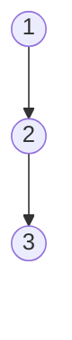
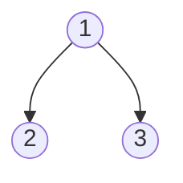
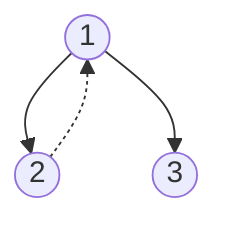

程序设计=算法+数据结构

数据结构=结构定义+结构操作

课程综述


------

# 一.顺序表

## 1.结构定义


结构定义主要包含下面3个方面：

1. 存放数据的数组
2. 顺序表的大小size
3. 当前顺序表的长度（顺序表中的元素个数）length

### 顺序表优缺点

1. 优点
   - 空间利用率高。（局部性原理，连续存放，命中率高） 
   - 存取速度高效，通过下标来直接存储。
2. 缺点
   - 插入和删除比较慢，比如：插入或者删除一个元素时，整个表需要遍历移动元素来重新排一次顺序。
   - 不可以增长长度，有空间限制,当需要存取的元素个数可能多于顺序表的元素个数时,会出现"溢出"问题.当元素个数远少于预先分配的空间时,空间浪费巨大。 

查找时间复杂度O(1)，插入和删除空间复杂度O(n)

## 2.结构操作

### 2.1插入操作


- 先将待插入位置后的数据整体往后平移一位
- 在待插入位置处插入数据
- length++

### 2.2删除操作


- 直接将待删除位置后的数据整体向前平移一位
- length--

## 3.代码演示

```c
#include<stdio.h>
#include<stdlib.h>
#include<time.h>
//结构定义 存取整型数据
typedef struct Vector{
    int *data;
    int size, length;
} Vector;
//顺序表初始化
Vector *init(int n){
    Vector *vec = (Vector *)malloc(sizeof(Vector));
    vec->data = (int *)malloc(sizeof(int) * n);
    vec->size = n;
    vec->length = 0;//length指向下一个要插入的位置
    return vec;
}
//插入操作
int insert(Vector *vec, int ind, int val){
    if(vec == NULL) return 0;
    if(ind < 0 || ind > vec->length) return 0;
    if(vec->length >= vec->size) return 0;
    for(int i = vec->length - 1; i >= ind; i--){
        vec->data[i + 1] = vec->data[i];
    }
    vec->data[ind] = val;
    vec->length++;
    return 1;
}
//删除操作
int erase(Vector *vec, int ind){
    if(vec == NULL) return 0;
    if(ind < 0 || ind >= vec->length) return 0;
    for(int i = ind; i < vec->length - 1; i++){
        vec->data[i] = vec->data[i + 1];
    }
    vec->length--;
    return 1;
}
//打印顺序表
void output(Vector *vec){
    printf("Vector(%d) = [", vec->length);
    for(int i = 0; i < vec->length; i++){
        i && printf(", ");
        printf("%d", vec->data[i]);
    }
    printf("]\n");
}

//释放顺序表 防止内存泄漏
void clear(Vector *vec){
    if(vec == NULL) return ;
    free(vec->data);
    free(vec);
    return ;
}

//80%插入数据，%20删除数据
int main(){
    srand(time(0));
    #define MAX_OP 20
    Vector *vec = init(MAX_OP);
    int op, ind, val;
    for(int i = 0; i < MAX_OP; i++){
        op = rand() % 5;
        ind = rand() % (vec->length + 2)- 1;
        val = rand() % 100;
        switch(op){
            case 0:
            case 1:
            case 2:
            case 3:{
                printf("insert %d at %d to Vector = %d\n", val, ind, insert(vec, ind, val));
            }break;
            case 4:{
                printf("erase item at %d from Vector = %d\n", ind, erase(vec, ind));
            }break;
        }
        output(vec);
        printf("\n");
    }
    clear(vec);
    return 0;
}

```

## 4.优化（malloc、calloc、realloc）

优化：单纯的数组也可以进行上述的操作，为了实现更多的功能，我们在上面的基础加上扩容操作，即当顺序表满了之后，可以扩大空间

引出3个地址开辟的函数：

- malloc：单纯的开辟空间
- calloc：开辟空间之后对该片地址上的数值清0
- realloc：在原有空间的基础上扩大开辟的空间

当要对 `vec->data`进行扩容时，我们可以选用realloc函数在原有的基础上进行扩容，下面给出一个错误的扩容操作

```c
//错误扩容方法
int expand(Vector *vec){
    vec->size *= 2;
    vec->data = (int *)realloc(vec->data, sizeof(int) * vec->size);
    return 1;
}

```

乍一看，我们发现可以进行扩容，下面我们分析一下realloc的工作方式

[https://www.cnblogs.com/ren54/archive/2008/11/20/1337545.html](https://www.cnblogs.com/ren54/archive/2008/11/20/1337545.html)

- 当`vec->data`后面的空间足够时，直接在其后面开辟等大的空间，返回地址`vec->data`
- 当`vec->data`后面的空间不足时，我们先在其他空间充足的地方开辟所需的空间，地址为q，将`vec->data`中的数据copy到q的前半部分，最后释放掉`vec->data`指向的空间，并返回地址q

由上面realloc的两种工作方式我们可以看出当没有足够的空间时，我们的`q == NULL`，之后`vec->data`被时放掉，数据就丢失了，造成内存泄露！！！！！！！！！！数据丢失是很严重的问题

下面给出正确的扩容操作：

```c
//正确扩容方法
//先用一个中间量p记录新开辟的地址空间，防止直接将NULL赋值给vec->data
int expand(Vector *vec){
    int extr_size = vec->size;
    int *p;
    while(extr_size){//如果没有足够的空间，所需开辟的空间减半，循环，直到找到一个合适extr_size
        p = (int *)realloc(vec->data, sizeof(int) * (vec->size + extr_size));
        if(p) break;
        extr_size /= 2;
    }
    if(p == NULL) return 0;//循环结束时p仍为NULL，说明一点空间没有了，开辟失败
    vec->data = p;
    vec->size += extr_size;
    return 1;
}

//插入操作需要修改部分内容
int insert(Vector *vec, int ind, int val){
    if(vec == NULL) return 0;
    if(ind < 0 || ind > vec->length) return 0;
    if(vec->length >= vec->size) {
        if(!expand(vec)) return 0;
        printf("expand successfully! size = %d\n", vec->size);
    }
    for(int i = vec->length - 1; i >= ind; i--){
        vec->data[i + 1] = vec->data[i];
    }
    vec->data[ind] = val;
    vec->length++;
    return 1;
}


//为了现实效果更好，主函数修改
Vector *vec = init(5);

```

运行结果：


# 二.链表

## 1.结构定义

不需要一片连续的存储空间，空间可以是分散的，通过指针连接在一起


链表是由一个个链表节点组成，前一个节点指向后一个节点

链表=程序内部+内存内部，在程序中我们只能拿到一个头节点head，当需要对其他节点进行操作时，我们需要通过头节点不断向后遍历拿到所需的节点

链表节点由两部分组成：

- 数据域：存放数据
- 指针域：用来指向下一个节点

### 链表的优缺点

1. 优点：
   - 插入和删除速度快，保留原有的物理顺序，比如：插入或者删除一个元素时，只需要改变指针指向即可。
   - 没有空间限制,存储元素的个数无上限,基本只与内存空间大小有关。
2. 缺点：
   - 占用额外的空间以存储指针(浪费空间，不连续存放，malloc开辟，空间碎片多) 
   - 查找速度慢，因为查找时，需要循环链表访问，需要从开始节点一个一个节点去查找元素访问。

查找时间复杂度O(n)，插入或删除时间复杂度O(1)

## 2.结构操作

### 2.1链表插入


如上图，将4节点插入到1号节点之后

1. 先让4号节点指针指向2号节点（1号节点指向的地址）
2. 在将1号节点的指针改为指向4号节点

如果顺序改变，先将1号节点指向4号节点，那么我们想让4号指针指向2号节点时就找不到2号节点的地址了，造成内存泄露


### 2.2链表删除

1. 用一个临时变量指向待删除节点，避免地址丢失
2. 将待删除节点的前一个节点指向待删除节点的后一个节点
3. 释放掉待删除节点即可（临时变量）

## 3.代码演示

```c
#include<stdio.h>
#include<stdlib.h>
#include<time.h>
//结构定义
typedef struct Node{
    int data;
    struct Node *next;
} Node;

//获取一个新的节点
Node *getNewNode(int val){
    Node *p = (Node *)malloc(sizeof(Node));
    p->data = val;
    p->next = NULL;
    return p;
}

//插入操作 需要拿到待插入节点的前一个节点
//虚拟头节点，将链表的头节点也当作一个节点
int insert(Node *head, int ind, int val){
    if(head == NULL) return 0;
    if(ind < 0) return 0;
    Node *p = head, *node = getNewNode(val);
    //p为虚拟头节点，当从这往后走ind步，即可拿到待插入节点的前一个节点，节点从0开始
    while(ind-- && p != NULL) p = p->next;//当ind>链表长度时，跳出并return 0
    if(p == NULL) return 0;
    node->next = p->next;
    p->next = node;
    return 1;
}

//删除操作
int erase(Node *head, int ind){
    if(head == NULL) return 0;
    if(ind < 0) return 0;
    Node *p = head, *q;
    while(ind-- && p != NULL) p = p->next;
    if(p == NULL) return 0;
    q = p->next;
    p->next = q->next;
    free(q);
    return 1;
}
//翻转链表（头插法）
//看不懂不用着急
//下面有介绍
void rev(Node *head){
    if(head == NULL) return;
    Node *p = head->next, *q = p->next;
    head->next = NULL;
    while(p){
        q = p->next;
        p->next = head->next;
        head->next = p;
        p = q;
    }
}

//打印链表
void output(Node *head){
    printf("List = [");
    for(Node *p = head->next; p; p = p->next){
        printf("%d->", p->data);
    }
    printf("]\n");
    return ;
}

//释放链表
void clear(Node *node){
    if(node == NULL) return ;
    Node *p = node->next, *q;
    while(p){
        q = p->next;
        free(p);
        p = q;
    }
    free(node);
    return ;
}

int main(){
    #define MAX_OP 20
    srand(time(0));
    Node *head = getNewNode(0);//获取一个链表头 data无所谓是多少 将这个表头作为虚拟头节点
    //得到一个初始链表
    for(int i = 0; i < MAX_OP; i++){
        int val = rand() % 100;
        insert(head, i, val);
    }
    printf("----------------List-------------------\n");
    output(head);
    printf("------------------------------------------------------\n");
    printf("插入操作:1 ind val\n删除操作:2 ind 0\n翻转操作:3 0 0\nplease input...\n");
    int op, ind, val;
    //不断的输入操作
    while(scanf("%d%d%d", &op, &ind, &val) != EOF){
        switch(op){
            case 1:{
                printf("insert %d at %d in List = %d\n", val, ind, insert(head, ind, val));
            } break;
            case 2:{
                printf("erase item at %d in List = %d\n", ind, erase(head, ind));
            } break;
            case 3:{
                printf("rev List...\n");
                rev(head);
            }
        }
        output(head);
    }
    clear(head);
    return 0;
}
//为了更方便操作，我们可以将链表头（虚拟头节点）单独定义一个结构体，在其中加一个length来表示链表长度
```

## 4.头插法

当我们拿到一个链表想要翻转时，我们可以采用头插法


起初我们的链表是head->1->2->3->NULL

头插法思想：遍历整个链表，将每个节点都插入到head后面

- head->NULL
- head->1->NULL
- head->2->1->NULL
- head->3->2->1->NULL

具体操作：

head是虚拟头节点指向NULL，p指向第一个节点，q指向第二个节点

1. p->next = head->next
2. head->next = p
3. p = q, q = q->next

代码实现如下：

```c
//翻转链表（头插法）
void rev(Node *head){
    if(head == NULL) return;
    Node *p = head->next, *q = p->next;
    head->next = NULL;
    while(p){
        q = p->next;
        p->next = head->next;
        head->next = p;
        p = q;
    }
}
```

代码实现：


## 5.单向循环链表


head永远指向尾节点


## 6.实现箭头


```c
#include<stdio.h>
#include<stdlib.h>
#include<time.h>

typedef struct ListNode{
    int data;
    struct ListNode *next;
} ListNode;

typedef struct List{
    
    ListNode head;
    int length;
} List;


ListNode *getNewNode(int val){
    ListNode *p = (ListNode *)malloc(sizeof(ListNode));
    p->data = val;
    p->next = NULL;
    return p;
}
List *getLinkList(){
    List *l = (List *)malloc(sizeof(List));
    l->head.next = NULL;
    l->length = 0;
    return l;
}

int insert(List *l, int ind, int val){
    int ret = ind;
    if(l == NULL) return 0;
    if(ind < 0 || ind > l->length) return 0;
    ListNode *p = &(l->head), *node = getNewNode(val);
    while(ind--) p = p->next;//ind = 1
    node->next = p->next;
    p->next = node;
    l->length += 1;
    return ret;
}

int erase(List *l, int ind){
    int ret = ind;
    if(l == NULL) return 0;
    if(ind < 0 || ind >= l->length) return 0;
    ListNode *p = &(l->head), *q;
    while(ind--) p = p->next;
    q = p->next;
    p->next = q->next;
    free(q);
    l->length -= 1;
    return ret;
}
void output_search(List *l, int ind){
    char str[500];
    int offset = 3;
    ListNode *p = l->head.next;
    while(ind != -1 && p){
        offset += sprintf(str, "%d->", p->data);
        ind--;
        p = p->next;
    }
    for(int i = 0; i < offset; i++) printf(" ");
    printf("^\n");
    for(int i = 0; i < offset; i++) printf(" ");
    printf("|\n\n");
    return ;
    
}

void output(List *l){
    printf("head->");
    for(ListNode *p = l->head.next; p; p = p->next){
        printf("%d->", p->data);
    }
    printf("NULL\n");
    return ;
}


void clear_ListNode(ListNode *node){
    if(node == NULL) return ;
    free(node);
    return ;
}
void clear_list(List *l){
    if(l == NULL) return ;
    ListNode *p = l->head.next, *q;
    while(p){
        q = p->next;
        clear_ListNode(p);
        p = q;
    }
    free(l);
    return ;
}


int main(){
    #define max_op 20
    srand(time(0));
    List *l = getLinkList();
    int op, ind, val, flag;
    for(int i = 0; i < max_op; i++){
        op = rand() % 4;
        ind = rand() % (l->length + 3) - 1;
        val = rand() % 100;
        switch(op) {
            case 0:
            case 1:
            case 2:{
                flag = insert(l, ind, val);
                printf("insert %d at %d to List = %d\n", val, ind, flag);
            
            } break;
            case 3: {
                flag = -1;
                printf("erase item at %d from List = %d\n", ind, erase(l, ind));
                
            } break;

        }
        output(l);
        output_search(l, flag);
        printf("\n");
    }
    clear_list(l);
    return 0;
}

```

## 作业


# 三.队列

## 1.结构定义


FIFO (first in/out)先进先出

length 队列长度

head队头 tail队尾

data_type数据类型

## 2.结构操作

### 2.1出队操作


head+1

### 2.2入队操作


tail+1

tail有两种方式  指向最后一个/最后一个的下一个

### 2.3假溢出/循环队列


出队3个  入队4个  但是实际上还可以插入新的数据

通过循环队列解决


count值记录元素个数

(tail+1) % length(与循环数组一样)

### 2.4单调队列

## 3.代码演示

```c
#include<stdio.h>
#include<stdlib.h>
#include<time.h>

//结构定义
typedef struct Queue{
    int *data;
    int size, head, tail;
} Queue;

//初始化
Queue *init(int n){
    Queue *q = (Queue *)malloc(sizeof(Queue));
    q->data = (int *)malloc(sizeof(int) * n);
    q->size = n;
    q->head = q->tail = 0;//这里的tail指向最后一个元素的下一位
    return q;
}
//判空
int empty(Queue *q){
    return q->head == q->tail;
}
//返回队首元素
int front(Queue *q){
    return q->data[q->head];
}

//入队
int push(Queue *q, int val){
    if(q == NULL) return 0;
    if(q->tail >= q->size) return 0;
    q->data[q->tail++] = val;
    return 1;
}
//出队
int pop(Queue *q){
    if(q == NULL) return 0;
    if(empty(q)) return 0;
    q->head++;
    return 1;
}
//遍历输出
void output(Queue *q){
    printf("Queue(%d) = [", q->tail - q->head);
    for(int i = q->head; i < q->tail; i++){
        i != q->head && printf(" ");
        printf("%d", q->data[i]);
    }
    printf("]\n");
    return ;
}
//清空
void clear(Queue *q){
    if(q == NULL) return ;
    free(q->data);
    free(q);
    return ;
}

int main(){
    srand(time(0));
    #define max_op 10
    Queue  *q = init(max_op);
    int op, val;
    for(int i = 0; i < 2 * max_op; i++){
        op = rand() % 4;
        val = rand() % 100;
        switch(op){
            case 0:
            case 1:
            case 2: {
                printf("push %d to Queue = %d\n", val, push(q, val));
            } break;
            case 3: {
                int a = front(q);
                printf("pop %d from Queue = %d\n", a, pop(q));
                //printf("pop %d from Queue = %d\n", front(q), pop(q));
                //环境问题，写在一起 先执行pop，在执行front
            } break;
        }
        output(q);
        printf("\n");
    }
    clear(q);
    return 0;
}

```

上述代码会有假溢出问题，可以用循环队列来解决

```c
#include<stdio.h>
#include<stdlib.h>
#include<time.h>

//结构定义
typedef struct Queue{
    int *data;
    int size, head, tail, cnt;
} Queue;

//初始化
Queue *init(int n){
    Queue *q = (Queue *)malloc(sizeof(Queue));
    q->data = (int *)malloc(sizeof(int) * n);
    q->size = n;
    q->head = q->tail = q->cnt = 0;//这里的tail指向最后一个元素的下一位
    return q;
}
//判空
int empty(Queue *q){
    return q->cnt == 0;
}
//返回队首元素
int front(Queue *q){
    return q->data[q->head];
}

//入队
int push(Queue *q, int val){
    if(q == NULL) return 0;
    if(q->cnt >= q->size) return 0;
    q->data[q->tail++] = val;
    if(q->tail >= q->size) q->tail -= q->size;//
    q->cnt++;
    return 1;
}
//出队
int pop(Queue *q){
    if(q == NULL) return 0;
    if(empty(q)) return 0;
    q->head++;
    if(q->head >= q->size) q->head -= q->size;//
    q->cnt--;
    return 1;
}
//遍历输出
void output(Queue *q){
    printf("Queue(%d) = [", q->cnt);
    for(int i = q->head, j = 0; j < q->cnt; j++){
        j && printf(", ");
        printf("%d", q->data[(i + j) % q->size]);
    }
    printf("]\n");
    return ;
}
//清空
void clear(Queue *q){
    if(q == NULL) return ;
    free(q->data);
    free(q);
    return ;
}

int main(){
    srand(time(0));
    #define max_op 10
    Queue  *q = init(max_op);
    int op, val;
    for(int i = 0; i < 2 * max_op; i++){
        op = rand() % 4;
        val = rand() % 100;
        switch(op){
            case 0:
            case 1:
            case 2: {
                printf("push %d to Queue = %d\n", val, push(q, val));
            } break;
            case 3: {
                int a = front(q);
                printf("pop %d from Queue = %d\n", a, pop(q));
                //printf("pop %d from Queue = %d\n", front(q), pop(q));
                //环境问题，写在一起 先执行pop，在执行front
            } break;
        }
        output(q);
        printf("\n");
    }
    clear(q);
    return 0;
}

```


# 四.栈

## 1.结构定义


类似羽毛球桶

FILO先进后出

size表示栈的空间大小

top栈顶指针

date_type数据类型

## 2.结构操作

### 2.1入栈push


top+1

### 2.2出栈pop


top-1

### 2.3打印栈顶元素top()函数

### 2.4判空操作empty()函数

### 2.5单调栈

## 3.栈的思想


栈：处理完全包含关系的问题

eg：括号匹配，树

问题分析：栈->左括号入栈->遇到右括号判断栈顶元素是否匹配->匹配成功出栈


系统栈大小8MB  系统爆栈

函数调用时，递归等需要用到系统栈

程序运行最基本的单位就是进程，进程由操作系统划分

爆栈后 核心与转储  停止程序运行，将数据保存在其他文件中cal文件中

用系统栈的程序


## 4.代码实现

```c
#include<stdio.h>
#include<stdlib.h>
#include<time.h>

typedef struct Stack{
    int *data;
    int top, size;
} Stack;

Stack *init(int n){
    Stack *s = (Stack *)malloc(sizeof(Stack));
    s->data = (int *)malloc(sizeof(int) * n);
    s->top = -1;//top指向栈顶元素的位值
    s->size = n;
    return s;
}

int empty(Stack *s){
    return s->top == -1;
}

int top(Stack *s){
    return s->data[s->top];
}

int push(Stack *s, int val){
    if(s == NULL) return 0;
    if(s->top + 1 == s->size) return 0;
    //s->top++;
    s->data[++(s->top)] = val;
    return 1;
}

int pop(Stack *s){
    if(s == NULL) return 0;
    if(empty(s)) return 0;
    s->top--;
    return 1;
}

void output(Stack *s){
    printf("Stack(%d) = [", s->top + 1);
    for(int i = 0; i <= s->top; i++){
        i && printf(", ");
        printf("%d", s->data[i]);
    }
    printf("]\n");
    return ;
}

void clear(Stack *s){
    if(s == NULL) return ;
    free(s->data);
    free(s);
    return ;
}

int main(){
    srand(time(0));
    #define max_op 20
    Stack *s = init(max_op);
    int op, val;
    for(int i = 0; i < max_op; i++){
        op = rand() % 4;
        val = rand() % 100;
        switch(op){
            case 0:
            case 1:
            case 2:{
                printf("push %d to Stack = %d\n", val, push(s, val));
            } break;
            case 3:{
                int a = top(s);
                printf("pop %d from Stack = %d\n", a, pop(s));
            } break;
        }
        output(s);
        
        printf("\n");
    }
    clear(s);

    return 0;
}
```

扩容操作

a.


b.

```c
#include<stdio.h>
#include<stdlib.h>
#include<time.h>

typedef struct Stack{
    int *data;
    int top, size;
} Stack;

Stack *init(int n){
    Stack *s = (Stack *)malloc(sizeof(Stack));
    s->data = (int *)malloc(sizeof(int) * n);
    s->top = -1;//top指向栈顶元素的位值
    s->size = n;
    return s;
}

int empty(Stack *s){
    return s->top == -1;
}

//弹出栈顶元素
int top(Stack *s){
    return s->data[s->top];
}

void expand(Stack *s){
    int *old = s->data;
    s->data = (int *)malloc(sizeof(int) * 2 * s->size);
    for(int i = 0; i <= s->top; i++){
        s->data[i] = old[i];
    }
    s->size *= 2;
    free(old);
    return ;
}

int push(Stack *s, int val){
    if(s == NULL) return 0;
    if(s->top + 1 == s->size) expand(s);
    //s->top++;
    s->data[++(s->top)] = val;
    return 1;
}

int pop(Stack *s){
    if(s == NULL) return 0;
    if(empty(s)) return 0;
    s->top--;
    return 1;
}

void output(Stack *s){
    printf("Stack(%d) = [", s->top + 1);
    for(int i = 0; i <= s->top; i++){
        i && printf(", ");
        printf("%d", s->data[i]);
    }
    printf("]\n");
    return ;
}

void clear(Stack *s){
    if(s == NULL) return ;
    free(s->data);
    free(s);
    return ;
}


int main(){
    srand(time(0));
    #define max_op 20
    Stack *s = init(max_op);
    int op, val;
    for(int i = 0; i < 2 * max_op; i++){
        op = rand() % 4;
        val = rand() % 100;
        switch(op){
            case 0:
            case 1:
            case 2:{
                printf("push %d to Stack = %d\n", val, push(s, val));
            } break;
            case 3:{
                printf("pop %d from Stack = ", top(s));
                printf("%d\n", pop(s));//环境影响，写在一块会先执行pop（此电脑）
            } break;
        }
        output(s);
        
        printf("\n");
    }
    clear(s);

    return 0;
}

```

作业题：


# 五.树

## 1.树的结构


树=节点+边

节点->集合

边->对应关系

1号节点=全集

2.3.4是子集 2+3+4=1

完全包含关系的数据结构 --栈可以解决此类问题


链表是一颗特殊的树

struct Node *next->struct Node *next[3]


最下面的度为0的节点为叶子节点

树的深度和高度一样，节点的不一定

深度：从根结点往下看  高度：从下面的节点往上看

度：子节点的个数

## 2.二叉树


通过节点=边数+1式子得到

所有的n叉树都可以转换为2叉树

N叉树->非确定性问题

二叉树->确定性问题

2为1的左孩子 3为1的右孩子

通过左孩子右兄弟表示方法转化为二叉树（十字链表法）


前序遍历124536   第一个是根结点

中序遍历425136 

后序遍历452631 最后一个是根结点

前+中 或 后+中可以恢复二叉树


完全二叉树：度为1的节点只会少一个右孩子

满二叉树：度只为0 和 2


完全二叉树可以用连续空间存储   时间复杂度O(1)


二叉树->广义表->字符串

作业


## 3.二叉顺序树-代码演示

val > root->data    val-->左孩子

val < root->data    val-->右孩子

广义表顺序 = 前序遍历（根左右）

```c
#include<stdio.h>
#include<stdlib.h>
#include<time.h>
//二叉顺序树
//val < root->data  val -> root->lchild
//val > root->data  val -> root->rchild

//结构定义
typedef struct Node{
    int data;
    struct Node *lchild, *rchild;
} Node;

typedef struct Tree{
    Node *root;
    int n;
} Tree;

//节点初始化
Node *getNewNode(int val){
    Node *p = (Node *)malloc(sizeof(Node));
    p->data = val;
    p->lchild = p->rchild = NULL;
    return p;
}

//树的初始化
Tree *getNewTree(){
    Tree *tree = (Tree *)malloc(sizeof(Tree));
    tree->root = NULL;
    tree->n = 0;
    return tree;
}

//下面两个函数往树中按顺序插入数据
Node *insertNode(Node *root, int val, int *ret){
    if(root == NULL){
        *ret = 1;
        return getNewNode(val);
    }
    if(root->data == val) return root;
    if(val < root->data) root->lchild = insertNode(root->lchild, val, ret);
    else root->rchild = insertNode(root->rchild, val, ret);
    return root;
}

void insert(Tree *tree, int val){
    int flag = 0;
    tree->root = insertNode(tree->root, val, &flag);
    tree->n += flag;
    return ;
}

//下面两个函数打印树的广义表
void outputNode(Node *root){
    if(root == NULL) return ;
    printf("%d", root->data);
    if(root->lchild == NULL && root->rchild == NULL) return ;
    printf("(");
    outputNode(root->lchild);
    printf(",");
    outputNode(root->rchild);
    printf(")");
    return ;
}

void output(Tree *tree){
    printf("Tree(%d) = ", tree->n);
    outputNode(tree->root);
    printf("\n");
    return ;
}

//下面两个函数打印树的前序遍历
void pre_orderNode(Node *root){
    if(root == NULL) return ;
    printf("%d ", root->data);
    pre_orderNode(root->lchild);
    pre_orderNode(root->rchild);
    return ;
}

void pre_order(Tree *tree){
    printf("pre_order: ");
    pre_orderNode(tree->root);
    printf("\n");
}

//中序遍历
void in_orderNode(Node *root){
    if(root == NULL) return ;
    in_orderNode(root->lchild);
    printf("%d ", root->data);
    in_orderNode(root->rchild);
    return ;
}

void in_order(Tree *tree){
    printf("in_order: ");
    in_orderNode(tree->root);
    printf("\n");
}

//后序遍历
void post_orderNode(Node *root){
    if(root == NULL) return ;
    
    post_orderNode(root->lchild);
    post_orderNode(root->rchild);
    printf("%d ", root->data);
    return ;
}

void post_order(Tree *tree){
    printf("post_order: ");
    post_orderNode(tree->root);
    printf("\n");
}

//清空节点和树
void clear_Node(Node *node){
    if(node == NULL) return ;
    clear_Node(node->lchild);
    clear_Node(node->rchild);
    free(node);
    return ;
}

void clear_Tree(Tree *tree){
    if(tree == NULL) return ;
    clear_Node(tree->root);
    free(tree);
    return ;
}

int main(){
    srand(time(0));
    #define max_op 20
    Tree *tree = getNewTree();
    for(int i = 0; i < max_op; i++){
        int val = rand() % 100;
        insert(tree, val);
        output(tree);
    }
    pre_order(tree);
    in_order(tree);
    post_order(tree);
    clear_Tree(tree);
    return 0;
}

```


## 4.二叉树的线索化

中序遍历（左根右）



上图是一个链表，其可以看作一种特殊的二叉树，其高度为h

进行中序遍历递归操作时，递归次数与h相关

递归是在系统栈中进行的， 系统栈总共8MB， 当h很大时会发生爆栈的情况



其中序遍历是2 1 3，由2-->1的过程需要递归回溯



如果从2-->1有一个指针就可以不需要递归回溯了

我们假设二叉树共n个节点，则其有n-1条边

n个节点一共2n个指针，而我们只使用了n-1个指针，还有n+1个指针是空闲的，我们便可以利用这n+1个指针

上图1号节点指针都用了  2.3号节点的2个指针都为空

将2的rchild-->1，那么2-->的过程就不需要递归回溯了

我们将这样的操作叫标记线索

线索有两种：

| 前驱操作 | 3-->1 | 由1找到3 | 用空的lchild指针 |
| :------: | :---: | :------: | :--------------: |
| 后继操作 | 2-->1 | 由2找到1 | 用空的rchild指针 |

2----->1——>3 我们进行中序遍历时用不到前驱操作，进行其他遍历时会用得到

那么当前的节点的左右指针是真正的指针还是线索呢？

我们需要用两个标记位来标记rtag和ltag


代码演示：

```c
//线索化 中序遍历
#include<stdio.h>
#include<stdlib.h>
#include<time.h>

#define NORMAL 0
#define THREAD 1

typedef struct Node{
    int data;
    struct Node *lchild, *rchild;
    int ltag, rtag;
} Node;

typedef struct Tree{
    Node *root;
    int n;
} Tree;

Node *getNewNode(int val){
    Node *p = (Node *)malloc(sizeof(Node));
    p->data = val;
    p->rchild = p->lchild = NULL;
    p->ltag = p->rtag = NORMAL;
    return p;
}

Tree *getNewTree(){
    Tree *tree = (Tree *)malloc(sizeof(Tree));
    tree->root = NULL;
    tree->n = 0;
    return tree;
}

Node *insertNode(Node *root, int val, int *ret){
    if(root == NULL){
        *ret = 1;
        return getNewNode(val);
    }
    if(val == root->data) return root;
    if(val < root->data) root->lchild = insertNode(root->lchild, val, ret);
    else root->rchild = insertNode(root->rchild, val, ret);
    return root;
}

void insert(Tree *tree, int val){
    int flag = 0;
    tree->root = insertNode(tree->root, val, &flag);
    tree->n += flag;
    return ;
}

//下面两个函数加线索
//pre记录上一个节点
void build_threadNode(Node *root){
    if(root == NULL) return ;
    static Node *pre = NULL;
    build_threadNode(root->lchild);
    if(root->lchild == NULL){
        root->lchild = pre;
        root->ltag = THREAD;
    }
    if(pre != NULL && pre->rchild == NULL){
        pre->rchild = root;
        pre->rtag = THREAD;
    }
    pre = root;
    build_threadNode(root->rchild);
    return ;
}

void build_threadTree(Tree *tree){
    if(tree == NULL) return ;
    build_threadNode(tree->root);
    return ;
}

//找到最左位置
Node *most_left(Node *p){
    while(p && p->ltag == NORMAL && p->lchild != NULL){
        p = p->lchild;
    }
    return p;
}
/*
//通过线索进行输出
void outputNode(Node *root){
    Node *p = most_left(root);
    while(p){
        printf("%d ", p->data);
        if(p->rtag == THREAD){
            p = p->rchild;
        } else{
            p = most_left(p->rchild);
        }
    }
    return ;
}
*/


//普通输出
void outputNode(Node *root){
    if(root == NULL) return ;
    if(root->ltag == NORMAL) outputNode(root->lchild);
    printf("%d ", root->data);
    if(root->rtag == NORMAL) outputNode(root->rchild);
    return ;
}


void outputTree(Tree *tree){
    if(tree == NULL) return ;
    outputNode(tree->root);
    printf("\n");
    return ;
}
//中序遍历
void in_orderNode(Node *root){
    if(root == NULL) return ;
    if(root->ltag == NORMAL) in_orderNode(root->lchild);
    printf("%d ", root->data);
    if(root->rtag == NORMAL) in_orderNode(root->rchild);
    return ;
}

void in_order(Tree *tree){
    printf("in_orer: ");
    in_orderNode(tree->root);
    printf("\n");
    return ;
}

void clear_node(Node *root){
    if(root == NULL) return;
    if(root->ltag == NORMAL) clear_node(root->lchild);
    if(root->rtag == NORMAL) clear_node(root->rchild);
    free(root);
    return ;
}

void clear_tree(Tree *tree){
    if(tree == NULL) return ;
    clear_node(tree->root);
    return ;
}

int main(){
    srand(time(0));
    #define max_op 100000 
    Tree *tree = getNewTree();
    for(int i = 0; i < max_op ; i++){
        int val = rand() % (max_op * 10);
        insert(tree, val);
    }
    build_threadTree(tree);
    outputTree(tree);
    in_order(tree);
    clear_tree(tree);
    return 0;
}

```

## 5.广义表还原二叉树


代码演示：

```c
#include<stdio.h>
#include<stdlib.h>
#include<string.h>
#include<time.h>

typedef struct Node
{
    char data;
    struct Node *lchild, *rchild;
} Node;

typedef struct Tree
{
    Node *root;
    int n;
} Tree;

typedef struct Stack{
    Node **data;
    int top;
    int size;
} Stack;

Node *getNewNode(int val){
    Node *p = (Node *)malloc(sizeof(Node));
    p->data = val;
    p->lchild = p->rchild = NULL;
    return p;
}

Tree *getNewTree(){
    Tree *tree = (Tree *)malloc(sizeof(Tree));
    tree->root = NULL;
    tree->n = 0;
    return tree;
}

Stack *init_stack(int n){
    Stack *s = (Stack *)malloc(sizeof(Stack));
    s->data = (Node **)malloc(sizeof(Node *) * n);
    s->size = n;
    s->top = -1;
    return s;
}

int empty(Stack *s){
    return s->top == -1;
}

Node *top(Stack *s){
    return s->data[s->top];
}

int push(Stack *s, Node *val){
    if(s == NULL) return 0;
    if(s->top + 1 >= s->size) return 0;
    s->data[++s->top] = val;
    return 1;
}

int pop(Stack *s){
    if(empty(s)) return 0;
    s->top--;
    return 1;
}

void clear_stack(Stack *s);
Node *build(char *str, int *node_num){
    Node *temp = NULL, *p = NULL;
    Stack *s = init_stack(strlen(str));
    int flag = 0;
    while (str[0]){
        switch(str[0]){
            case '(': {
                push(s, temp);
                flag = 0;
                temp = NULL;
            }break;
            case ')':{
                p = top(s);//p记录根结点
                pop(s);
            } break;
            case ',':{
                flag = 1;
                temp = NULL;
            } break;
            case ' ': break;
            default:{
                temp = getNewNode(str[0]);//temp生成新字符对应的节点
                if(!empty(s) && flag == 0){
                    top(s)->lchild = temp;
                } else if(!empty(s) && flag == 1){
                    top(s)->rchild = temp;
                }
                (*node_num)++;
            } break;
        }
        ++str;
    }
    clear_stack(s);
    if(temp && !p) p = temp;
    return p;
}

void in_orderNode(Node *root){
    if(root == NULL) return ;
    in_orderNode(root->lchild);
    printf("%c ", root->data);
    in_orderNode(root->rchild);
    return ;
}

void in_order(Tree *tree){
    printf("in_order:");
    in_orderNode(tree->root);
    printf("\n");
    return ;
}

void pre_orderNode(Node *node){
    if(node == NULL) return ;
    printf("%c ", node->data);
    pre_orderNode(node->lchild);
    pre_orderNode(node->rchild);
    return ;
}

void pre_order(Tree *tree){
    printf("pre_oder: ");
    pre_orderNode(tree->root);
    printf("\n");
    return ;
}
void post_orderNode(Node *node){
    if(node == NULL) return ;
    post_orderNode(node->lchild);
    post_orderNode(node->rchild);
    printf("%c ", node->data);
    return ;
}

void post_order(Tree *tree){
    printf("post_oder: ");
    post_orderNode(tree->root);
    printf("\n");
    return ;
}

void clear_node(Node *root){
    if(root == NULL) return ;
    clear_node(root->lchild);
    clear_node(root->rchild);
    free(root);
    return ;
}

void clear_tree(Tree *tree){
    if(tree == NULL) return ;
    clear_node(tree->root);
    free(tree);
    return ;
}

void  clear_stack(Stack *s){
    if(s == NULL) return ;
    free(s->data);
    free(s);
    return ;
}

int main(){
    char str[100];
    scanf("%s", str);
    int node_num = 0;
    Tree *tree = getNewTree();
    tree->root = build(str, &node_num);
    tree->n = node_num;
    pre_order(tree);
    in_order(tree);
    post_order(tree);
    clear_tree(tree);
    return 0;
}

```

Visio Studio Code配置编译环境

https://jingyan.baidu.com/album/64d05a020aa4bbde55f73b00.html?picindex=3

gdb段错误

#  六.堆与优先队列

## 1.堆

完全二叉树<-->数组


大顶堆：最大值是根节点，根结点大于左右孩子

小顶堆：最小值是根结点，根结点小于左右孩子

## 2.结构操作

### 尾部插入调整（向上调整）


堆的调整过程：向上调整


在数组中的调整过程：

父节点 （ℹ-1）/ 2

不断的比较父子节点大小并交换数值

### 头部弹出调整（向下调整）

弹出头部-->将最末的数值放在头部-->向下调整堆

将头部的13弹出


在数组中，将最末的元素放在第一个位置，向后调整

从尾部插入，从头部弹出，跟队列一致

## 3.堆排序


堆顶元素与堆尾互换-->向下调整-->重复-->这样最大的元素肯定在后面


## 4.优先队列


作业题：


## 5.优先队列-代码演示

```c
#include<stdio.h>
#include<stdlib.h>
#include<time.h>
#define swap(a, b){\
    __typeof(a) __temp = a;\
    a = b, b = __temp;\
}

typedef struct priority_queue
{
    int *data;
    int cnt, size;
} priority_queue;

priority_queue *init(int n){
    priority_queue *q = (priority_queue *)malloc(sizeof(priority_queue));
    q->data = (int *)malloc(sizeof(int) * (n+1));
    q->cnt = 0;
    q->size = n;
    return q;
}

int empty(priority_queue *q){
    return q->cnt == 0;
}

int top(priority_queue *q){
    return q->data[1];
}


int push(priority_queue *q, int val){
    if(q == NULL) return 0;
    if(q->cnt == q->size) return 0;
    q->cnt++;
    q->data[q->cnt] = val;
    int ind = q->cnt;

    while(ind >> 1 && q->data[ind] > q->data[ind >> 1]){
        swap(q->data[ind], q->data[ind >> 1]);
        ind >>= 1;
    }
    return 1;
}

int pop(priority_queue *q){
    if(q == NULL) return 0;
    if(empty(q)) return 0;
    q->data[1] = q->data[q->cnt--];
    //q->cnt--;
    int ind = 1;
    while((ind << 1) <= q->cnt){
        int temp = ind, l = ind << 1, r = ind << 1 | 1;
        if(q->data[l] > q->data[temp]) temp = l;
        if(r <= q->cnt && q->data[r] > q->data[temp]) temp = r;
        if(temp == ind) break;
        swap(q->data[ind], q->data[temp]);
        ind = temp;
    }
    return 1;
}

void clear(priority_queue *q){
    if(q == NULL) return;
    free(q->data);
    free(q);
    return ;
}

int main(){
    srand(time(0));
    #define max_op 20
    priority_queue *q = init(max_op);
    for(int i = 0; i < max_op; i++){
        int val = rand() % 100;
        push(q, val);
        printf("insert %d to queue\n", val);

    }
    for(int i = 0; i < max_op; i++){
        printf("%d ", top(q));
        pop(q);
    }
    printf("\n");
    clear(q);
    return 0;
}
```

节点调整的时间复杂度O(N*logN)

## 6.堆排序（自上而下建堆--代码演示）

每一层从上往下线性建堆O(N)

```c

//线性建堆 自上而下
#include<stdio.h>
#include<stdlib.h>
#include<time.h>
#define swap(a, b){\
    __typeof(a) __temp = a;\
    a = b; b = __temp;\
}
//将位置ind上放上最大值
//当ind的左孩子为最大值时，将左孩子的值与根结点交换，左孩子位置再继续寻找最大值放在左孩子位置上，以此类推，直至一条路径上的所有根节点都是最大的
//自顶向下调整堆 
void downUpdate(int *arr, int n, int ind){
    while((ind << 1) <= n){
        int temp = ind, l = ind << 1, r = ind << 1 | 1;
        if(arr[l] > arr[temp]) temp = l;
        if(r <= n && arr[r] > arr[temp]) temp = r;
        if(temp == ind) break;
        swap(arr[temp], arr[ind]);
        ind = temp;
    }
    return ;
}

void heap_sort(int *arr, int n){
    arr--;//arr[1]是第一个元素
    //首先进行的循环是先让数组整理成为一个堆 从n/2作为父节点调整 依次递减直到堆顶
    for(int i = n >> 1; i >= 1; i--){
        downUpdate(arr, n, i);
    }
    //执行头部弹出后 向下调整堆
    for(int i = n; i > 1; i--){
        swap(arr[i], arr[1]);
        downUpdate(arr, i - 1, 1);//downpdate中的循环进行多次
    }
    return ;
}

void output(int *arr, int n){
    printf("arr[%d] = [", n);
    for(int i = 0; i < n; i++){
        printf(" %d", arr[i]);
    }
    printf("]\n");
    return ;
}

int main(){
    srand(time(0));
    #define max_op 20
    int *arr = (int *)malloc(sizeof(int) * max_op);
    for(int i = 0; i < max_op; i++){
        int val = rand() % 100;
        arr[i] = val;
    }
    output(arr, max_op);
    heap_sort(arr, max_op);
    output(arr, max_op);
    free(arr);
    return 0;
}

```

# 七.排序与查找


稳定排序：序列中有两个相同的值，排序完成后两个值的相对位置保持不变

非稳定排序：相对位置发生变化

内部排序：在内存里面进行排序

外部排序：不一定全都加在到内存中，如归并排序

内存多数8G，排序32G的数据，数据不能全部加载进内存中，需要分批--归并排序就可以进行

## 1.稳定排序（内部和外部）--插入、冒泡和归并

### 1.1插入排序


时间复杂度O(n<sup>2</sup>)

待排序区的首个元素不断的插入到已排序区：

不断的比较待排序区的数值与前面数值的大小，直到符合条件

### 1.2冒泡排序


时间复杂度O(n<sup>2</sup>)

当进行3轮冒泡过程后，顺序就确定了，跳出遍历过程即可

当某一轮冒泡过程没有任何swap操作时，结束整个冒泡排序过程即可

加flag标记位

### 1.3归并排序


有两个有序数组长度分别为m和n，要合并为一个m+n的有序数组

定义两个指针分别指向m和n，比较指针位置的数值的大小，谁的小谁的放入新数组，并且指针++，继续进行判断，一共进行m+n次

上述操作时间复杂度O(n)

分治：将大问题不断划分为小问题


每一层的时间复杂度O(n)，一共logn层

归并排序的时间复杂度O(nlogn)

时间复杂度稳定在O(nlogn)，时间基本稳定，不会有最优或者最差，冒泡和插入有最有的情况

每次分治分成2部分--二路归并排序

### 1.4代码实现

```c
//稳定排序
#include<stdio.h>
#include<stdlib.h>
#include<time.h>
#include<string.h>
#define swap(a, b){\
    a ^= b;\
    b ^= a;\
    a ^= b;\
}

#define TEST(arr, n, func, args...){\
    int *num = (int *)malloc(sizeof(int) * n);\
    memcpy(num, arr, sizeof(int) * n);\
    output(num, n);\
    printf("%s = ", #func);\
    func(args);\
    output(num, n);\
    free(num);\
}

//冒泡排序
void bubble_sort(int *num, int n){
    int times = 1;
    for(int i = 1; i < n && times; i++){
        times = 0;
        for(int j = 0; j < n - i; j++){
            if(num[j] <= num[j + 1]) continue;
            swap(num[j], num[j + 1]);
            times++;    
        }
    }
    return ;
}

//插入排序
void insert(int *num, int n){
    for(int i = 1; i < n; i++){
        for(int j = i; j > 0 && num[j] < num[j - 1]; j--){
            swap(num[j], num[j - 1]);
        }
    }
    return ;
}

//归并排序
void merge_sort(int *num, int l, int r){
    if(r - l <= 1){
        if(r - l == 1 && num[l] > num[r]){
            swap(num[l], num[r]);
        }
        return ;
    }
    int mid = (l + r) >> 1;
    merge_sort(num, l, mid);
    merge_sort(num, mid + 1, r);
    int *temp = (int *)malloc(sizeof(int) * (r - l + 1));
    int p1 = l, p2 = mid + 1, k = 0;
    while(p1 <= mid || p2 <= r){
        if(p2 > r || (p1 <= mid && num[p1] <= num[p2])){
            temp[k++] = num[p1++];
        }
        else{
            temp[k++] = num[p2++];
        }
    }
    memcpy(num + l, temp, sizeof(int) * (r - l + 1));
    free(temp);
    return ;
}

void output(int *num, int n){
    printf("[");
    for(int i = 0; i < n; i++){
        printf(" %d", num[i]);
    }
    printf("]\n");
}

void randint(int *arr, int n){
    while(n--) arr[n] = rand() % 100;
    return ;
}

int main(){
    srand(time(0));
    #define max_op 20
    int arr[max_op];
    randint(arr, max_op);
    TEST(arr, max_op, insert, num, max_op);
    TEST(arr, max_op, bubble_sort, num, max_op);
    TEST(arr, max_op, merge_sort, num, 0, max_op - 1);

    return 0;
}

```


## 2.不稳定排序（内部和外部）

### 2.1选择排序


步骤：

1. 将数组分为『已排序区』和『待排序区』
2. 每一轮从『待排序区』中选择一个最小的元素放在『已排序区』的尾部
3. 直到『待排序区』没有元素为止

过程：

1. 第一轮：3   10交换
2. 第二轮：9    4交换
3. 第三轮：8    5交换   以此类推

时间复杂度：O(n<sup>2</sup>)

选择排序是不稳定排序：53521    第一次51交换 第一个5就在第二个5后边了

###  2.2快速排序

时间复杂度O(nlogn)但不稳定


步骤：

1. l为左指针指向最左元素，r为右指针指向最右元素，同时选取l的值为基准值
2. 指针前移r--，找到第一个比基准值小的元素，放在l指针的位置
3. 指针后移l++，找到第一个比基准值大的元素，放在r指针位置
4. 重复2-3步，直到l与r重合，重合的位置即为基准值所在的位置
5. 这样，序列就分为了m  n  两部分，前面的数值都小于基准值，后面的数值都大于等于基准值
6. 分别对两部分进行1-5步骤，递归，直至最终排序完成

时间复杂度:O(nlogn),不稳定，当序列完全逆序时，每次序列不能分成两部分了，时间复杂度退化为O(n<sup>2</sup>)

快速排序也是不稳定排序

l指针指向第一个元素，并且作为基准值

r元素指向最后一个元素

r--，寻找比基准值小的元素

l++，找到第一个比基准值大的数放在r指针位置

不断重复找到基准值的位置，完成了一轮，当前基准值前面的数值小于等于基准值，后面的值大于等于基准值

完成一轮后将数列分成了两部分，一共分了logn次，然后重复

完全逆序的数列快速排序会退化为选择排序.

### 2.3堆排序

[https://www.cnblogs.com/wanglei5205/p/8733524.html](https://www.cnblogs.com/wanglei5205/p/8733524.html)

### 2.4代码演示

```c
//非稳定排序
#include<stdio.h>
#include<stdlib.h>
#include<time.h>
#include<string.h>

//swap(a a)时，只有a一个变量可以储存数据，第一次异或时a就变成了0
//相同的数值可以用异或 但是地址相同时不行
#define swap(a, b){\
    __typeof(a) __temp = a;\
    a = b, b = __temp;\
}

#define TEST(arr, n, func, args...){\
    int *num = (int *)malloc(sizeof(int) * n);\
    memcpy(num, arr, sizeof(int) * n);\
    output(num, n);\
    printf("%s = ", #func);\
    func(args);\
    output(num, n);\
    free(num);\
}

//选择排序
void select_sort(int *num, int n){
    for(int i = 0; i < n - 1; i++){
        int ind = i;
        for(int j = i + 1; j < n; j++){
            if(num[ind] > num[j]) ind = j;
        }
        swap(num[i], num[ind]);
    }
    return ;
}

//快速排序
void quick_sort(int *num, int l, int r){
    if(r < l) return ;
    int x = l, y = r, z = num[l];
    while(x < y){
        while(x < y && num[y] >= z) y--;
        if(x < y) num[x++] = num[y];
        while(x < y && num[x] <= z) x++;
        if(x < y) num[y--] = num[x];
    }
    num[x] = z;
    quick_sort(num, l, x - 1);
    quick_sort(num, x + 1, r);
}

void adjust(int *num, int n, int ind){
    int left = 2 * ind + 1;
    int right = 2 * ind + 2;
    int maxind = ind;
    if(left < n && num[left] > num[maxind]) maxind = left;
    if(right < n && num[right] > num[maxind]) maxind = right;
    if(maxind != ind){
        swap(num[maxind], num[ind]);
        adjust(num, n, maxind);
    }
}
void heap_sort(int *num, int n){
    for(int i = n - 1; i >= 0; i--){
        adjust(num, n, i);
    }
    for(int i = n - 1; i >= 1; i--){
        swap(num[0], num[i]);
        adjust(num, i, 0);
    }
    return ;
}

void output(int *num, int n){
    printf("[");
    for(int i = 0; i < n; i++){
        printf(" %d", num[i]);
    }
    printf("]\n");
    return ;
}

void randinit(int *arr, int n){
    while(n--) arr[n] = rand() % 100;
    return ;
}

int main(){
    srand(time(0));
    #define max_op 20
    int arr[max_op];
    randinit(arr, max_op);
    TEST(arr, max_op, select_sort, num, max_op);
    TEST(arr, max_op, quick_sort, num, 0, max_op - 1);
    TEST(arr, max_op, heap_sort, num, max_op);
    return 0;
}

```

### 2.5快排优化

[https://blog.csdn.net/qq_38289815/article/details/82718428](https://blog.csdn.net/qq_38289815/article/details/82718428)

sort采取三值取中 + 插入排序 + 同类聚集

```cpp
#include<stdio.h>
#include<stdlib.h>
#include<string.h>
#include<time.h>
#include<unistd.h>

#define swap(a, b) {\
    __typeof(a) __tmp = a;\
    a = b, b = __tmp;\
}

#define TEST(arr, n, func, args...) ({\
    int *num = (int *)malloc(sizeof(int) * n);\
    memcpy(num, arr, sizeof(int) * n);\
    output(num, n);\
    printf("%s = ", #func);\
    clock_t start, stop;\
    start = clock();\
    func(args);\
    stop = clock();\
    output(num, n);\
    double t = 1.0 * (stop - start) / (_SC_CLK_TCK * 1.0);\
    printf("runtime = %lf\n", t);\
    printf("\n");\
    free(num);\
    t;\
})

/*
#define TEST(arr, n, func, args...){\
    int *num = (int *)malloc(sizeof(int) * n);\
    memcpy(num, arr, sizeof(int) * n);\
    printf("%s = ", #func);\
    clock_t start, stop;\
    start = clock();\
    func(args);\
    stop = clock();\
    double t = 1.0 * (stop - start) / (_SC_CLK_TCK * 1.0);\
    printf("runtime = %lf\n", t);\
    printf("\n");\
    free(num);\
}
*/
void insert_sort(int *num, int n){
    for(int i = 1; i < n; i++){
        for(int j = i - 1; j >= 0; j--){
            if(num[j] > num[j + 1]) {
                swap(num[j], num[j + 1]);
            }//else break;
        }
    }
    return ;
}

//固定基准
void quick_sort(int *num, int l, int r){
    if(l >= r) return ;
    int x = l, y = r, z = num[l];
    while(x < y){
        while(x < y && num[y] > z) y--;
        if(x < y) num[x++] = num[y];
        while(x < y && num[x] < z) x++;
        if(x < y) num[y--] = num[x];
    }
    num[x] = z;
    quick_sort(num, l, x - 1);
    quick_sort(num, x + 1, r);
    return ;
}

//随机基准
void quick_sort1(int *num, int l, int r){
    if(l >= r) return ;
    int x = l, y = r;
    int randnum = rand() % (r - l) + l;
    swap(num[l], num[randnum]);
    int z = num[l];
    while(x < y){
        while(x < y && num[y] > z) y--;
        if(x < y) num[x++] = num[y];
        while(x < y && num[x] < z) x++;
        if(x < y) num[y--] = num[x];
    }
    num[x] = z;
    quick_sort(num, l, x - 1);
    quick_sort(num, x + 1, r);
    return ;
}

//三数取中值做基准
void quick_sort2(int *num, int l, int r){
    if(l >= r) return ;
    int low = l, high = r, mid = (l + r) >> 1;
    if(num[mid] > num[high]) swap(num[mid], num[high]);
    if(num[low] > num[high]) swap(num[low], num[high]);
    if(num[mid] > num[low]) swap(num[low], num[mid]);
    int x = l, y = r, z = num[l];
    while(x < y){
        while(x < y && num[y] > z) y--;
        if(x < y) num[x++] = num[y];
        while(x < y && num[x] < z) x++;
        if(x < y) num[y--] = num[x];
    }
    num[x] = z;
    quick_sort(num, l, x - 1);
    quick_sort(num, x + 1, r);
    return ;
}

//当序列长度=10，引入插入排序
void quick_sort3(int *num, int l, int r){
    if(r - l + 1 <= 10){
        insert_sort(num + l, r - l + 1);
        return ;
    }
    int x = l, y = r, z = num[l];
    while(x < y){
        while(x < y && num[y] > z) y--;
        if(x < y) num[x++] = num[y];
        while(x < y && num[x] < z) x++;
        if(x < y) num[y--] = num[x];
    }
    num[x] = z;
    quick_sort(num, l, x - 1);
    quick_sort(num, x + 1, r);
    return ;
}

//三数取中 + 插入排序
void quick_sort4(int *num, int l, int r){
    if(r - l + 1 <= 10){
        insert_sort(num + l, r - l + 1);
        return ;
    }
    int low = l, high = r, mid = (l + r) >> 1;
    if(num[mid] > num[high]) swap(num[mid], num[high]);
    if(num[low] > num[high]) swap(num[low], num[high]);
    if(num[mid] > num[low]) swap(num[low], num[mid]);
    int x = l, y = r, z = num[l];
    while(x < y){
        while(x < y && num[y] > z) y--;
        if(x < y) num[x++] = num[y];
        while(x < y && num[x] < z) x++;
        if(x < y) num[y--] = num[x];
    }
    num[x] = z;
    quick_sort(num, l, x - 1);
    quick_sort(num, x + 1, r);
    return ;
}


//三数取中 + 插入排序 + 同类聚集
void quick_sort5(int *num, int l, int r){
    //当序列长度为10时，插入排序
    if(r - l + 1 <= 10){
        insert_sort(num + l, r - l + 1);
        return ;
    }
    int low = l, high = r, mid = (l + r) >> 1;
    //三数取中值做基准
    if(num[mid] > num[high]) swap(num[mid], num[high]);
    if(num[low] > num[high]) swap(num[low], num[high]);
    if(num[mid] > num[low]) swap(num[low], num[mid]);
    int x = l, y = r, z = num[l];
    //left左边与基准值相同的值的放置位置
    //right是右边同值的放置位置
    //leftLen左边与基准值相同的值的个数
    //right右边与基准值相同值的个数
    int left = l, right = r, leftLen = 0, rightLen = 0;
    while(x < y){
        while(x < y && num[y] >= z){
            //右边同值时处理 放到两侧
            if(num[y] == z){
                swap(num[y], num[right]);
                right--;
                rightLen++;
            }
            y--;
        }
        if(x < y) num[x++] = num[y];
        while(x < y && num[x] <= z){
            //左边同值处理
            if(num[x] == z){
                swap(num[left], num[x]);
                left++;
                leftLen++;
            }
            x++;
        }
        if(x < y) num[y--] = num[x];
    }
    num[x] = z;
    
    //快排完后将同值聚集到中间
    for(int j = l, i = x - 1; j < left; j++){
        swap(num[j], num[i--]);
    }

    
    for(int j = right + 1, i = x + 1; j <= r; j++){
        swap(num[j], num[i++]);
    }

    //递归的长度发生变化
    quick_sort(num, l, x - 1 - leftLen);
    quick_sort(num, x + 1 + rightLen, r);
    return ;
}

void randint(int *arr, int n){
    for(int i = 0; i < n; i++){
        arr[i] = rand() % 100;
    }
    return ;
}
void output(int *num, int n){
    printf("[");
    for(int i = 0; i < n; i++){
        printf("%d ", num[i]);
    }
    printf("]\n");
}

int main(){
    srand(time(0));
    #define max_op 10000
    int arr[max_op];
    randint(arr, max_op);
    //TEST(arr, max_op, insert_sort, num, max_op);
    double t1 = TEST(arr, max_op, quick_sort, num, 0, max_op - 1);
    double t2 = TEST(arr, max_op, quick_sort1, num, 0, max_op - 1);
    double t3 = TEST(arr, max_op, quick_sort2, num, 0, max_op - 1);
    double t4 = TEST(arr, max_op, quick_sort3, num, 0, max_op - 1);
    double t5 = TEST(arr, max_op, quick_sort4, num, 0, max_op - 1);
    double t6 = TEST(arr, max_op, quick_sort5, num, 0, max_op - 1);
    printf("quick_sort  = %lf, fixed\n", t1);
    printf("quick_sort1 = %lf, randbase\n", t2);
    printf("quick_sort2 = %lf, three mid\n", t3);
    printf("quick_sort3 = %lf, insert\n", t4);
    printf("quick_sort4 = %lf, three mid + insert\n", t5);
    printf("quick_sort5 = %lf, three mid + insert + gather\n", t6);

    return 0;
}

```


## 3.二分查找和三分查找

### 3.1二分查找

使用二分查找的前提是有序数列


数组是展开的函数 函数是压缩的数组

每次二分砍掉解题规模的一半 时间复杂度O(logn)

<u>特殊情况1：</u>

找到最后一个相同的数值1


全为0时返回-1  虚拟头指针的用处 注意mid的取值

<u>特殊情况2：</u>

找第一个相同的值1


虚拟尾指针用于全为0时

代码演示

```c
//二分查找
#include<stdio.h>
#define P(func, args...){\
    printf("%s = %d\n", #func, func(args));\
}
// 1 3 8 9 12 13
int binary_search1(int *num, int n, int x){
    int head = 0, tail = n - 1, mid;
    while(head <= tail){
        mid = (head + tail) >> 1;
        if(num[mid] == x) return mid;
        if(num[mid] < x) head = mid + 1;
        else tail = mid - 1;
    }
    return -1;
}

// 1111111110000000 找最后一个1(最后一个满足条件的位置)
int binary_search2(int *num, int n){
    int head = -1, tail = n - 1, mid;
    while(head < tail){
        mid = (head + tail + 1) >> 1;
        if(num[mid] == 1) head = mid;
        else tail = mid - 1;
    }
    return head;
}

//00000111111 找第一个1()
int binary_search3(int *num, int n){
    int head = 0, tail = n, mid;
    while(head < tail){
        mid = (head + tail) >> 1;
        if(num[mid] == 1) tail = mid;
        else head = mid + 1;
    }
    return head == n ? -1 : head;
}


int main(){
    int arr1[10] = {1, 3, 5, 7, 9, 11, 13, 15, 19, 21};
    int arr2[10] = {1, 1, 1, 1, 0, 0, 0, 0, 0, 0};
    int arr3[10] = {0, 0, 0, 0, 0, 0, 1, 1, 1, 1};
    P(binary_search1, arr1, 10, 7);
    P(binary_search2, arr2, 10);
    P(binary_search3, arr3, 10);
    return 0;
}

```


### 3.2三分查找

解决凹凸函数的极值问题


m1和m2是[L,R]的1/3和2/3处   每次会砍掉问题规模的1/3

当m1和m2的差值符合规定时，m1=m2=ans

## 4.哈希表

结构操作可以分为哈希函数和冲突处理

### 4.1哈希函数


通过数组下标访问value时间复杂度O(1)

数组的下标是整型数值 ，如果我们将任意类型的元素映射成整型，那么我们就可以直接访问下标

数值-->通过哈希函数的映射-->得到存储该数值的地址-->将数值放在对应的地址

如果要寻找value，则我们只需要通过映射得到地址，对比地址上的数是否为value即可

eg：


### 4.2冲突处理

问题：7和16都会要插入下标为7的位置-->冲突问题


冲突处理：7处有数值，放在后一个位置

没有完美的哈希函数，没有方法完全避免冲突

冲突处理的方法：

- 开放定址法
- 拉链法（链表）
- 再哈希法（2个以上的哈希函数）
- 建立公共溢出区

[https://www.cnblogs.com/zzdbullet/p/10512670.html](https://www.cnblogs.com/zzdbullet/p/10512670.html)

数值-->通过哈希函数的映射-->得到存储该数值的地址-->将数值放在对应的地址

如果要寻找value，则我们只需要通过映射得到地址，对比地址上的数是否为value即可

查找的时间复杂度O（1）

冲突处理方法：

1. 开放定址法：Hi = (H(key) + di) % size
   - 线性探测：当有冲突看下一个地址处是否有值 di = 1, 2, 3....
   - 二次探测：当有冲突在冲突位置的左右进行跳跃式探测 平方 di = 1^2^,-1^2^, 2^2^, -2^2^...
   - 伪随机探测：生成随机序列，在冲突位置进行偏移查看 di = 2, 9, 8, 6....
2. 拉链法：在每个地址上放一个链表即可
3. 再哈希法：2个及以上的哈希函数，一种哈希得到的地址冲突就用另一种哈希
4. 建立公共溢出区：凡是冲突的数值都放在溢出区

课后习题：


### 4.3代码演示

```c
//拉链法避免冲突
#include<stdio.h>
#include<stdlib.h>
#include<string.h>
typedef struct Node{
    char *str;
    struct Node *next;
} Node;

typedef struct HashTable{
    Node **data;
    int size;
} HashTable;
//头插法
Node *init_node(char *str, Node *head){
    Node *p = (Node *)malloc(sizeof(Node));
    p->str = strdup(str);
    p->next = head;
    return p;
}

HashTable *init_hashtable(int n){
    HashTable *h = (HashTable *)malloc(sizeof(HashTable));
    h->size = n << 1;
    h->data = (Node **)calloc(h->size, sizeof(Node *));
    return h;
}
//处理字符串的经典哈希函数之一
int BKDRHash(char *str){
    int seed = 31, hash = 0;
    for(int i = 0; str[i]; i++) hash = hash * seed + str[i];
    return hash & 0x7fffffff;//保证hash为正数
}

int insert(HashTable *h, char *str){
    int hash = BKDRHash(str);
    int ind = hash % h->size;
    h->data[ind] = init_node(str, h->data[ind]);
    return 1;
}

int search(HashTable *h, char *str){
    int hash = BKDRHash(str);
    int ind = hash % h->size;
    Node *p = h->data[ind];
    while(p && strcmp(p->str, str)) p = p->next;
    return p != NULL;

}

void clear_node(Node *node){
    if(node == NULL) return ;
    Node *p = node, *q;
    while(p){
        q = p->next;
        free(p->str);
        free(p);
        p = q;
    }
    free(q);
    return ;
}

void clear_hashtable(HashTable *h){
    if(h == NULL) return ;
    for(int i = 0; i < h->size; i++) clear_node(h->data[i]);
    free(h->data);
    free(h);
    return ;
}


int main(){
    int op;
    #define max_n 100
    char str[max_n + 5];
    HashTable *h = init_hashtable(max_n + 5);
    while(~scanf("%d%s", &op, str)){
        switch(op){
            case 0:
                printf("insert %s to hash table\n", str);
                insert(h, str);
                break;
            case 1:
                printf("search %s from hash table = %d\n", str, search(h, str));
                break;
        }
    }
    clear_hashtable(h);
    return 0;
}

```

## 5.快速选择

topk 

1. 快速选择：找到基准值位置 看看第k个位置是在基准值左边还是右边 递归
2. 堆：维护容量为k的堆即可

数据流/数据内存一次性放不下用堆解决

[https://leetcode-cn.com/problems/smallest-k-lcci/](https://leetcode-cn.com/problems/smallest-k-lcci/)

# 八.二叉排序树


左子树<根结点<右子树  

3 17 20 28 29 30 32 

中序遍历是顺序的，从小到大

## 1.插入操作

插入10


## 2.删除节点


叶子节点直接删除即可


中序遍历 17 18 19 20 28 29 30 32

删除20  可以用19 和 28节点放在20节点位置

所以要找待删除节点的前驱或者后继


方法1：用前驱19覆盖掉20之后，再删除19节点，待删除节点的前驱或者后继的度肯定不是2，如果是2的话此节点的右孩子肯定更大

方法2：用28覆盖20，在删除28节点，度只会为1


## 3.代码演示

```c
//二叉排序树
#include<stdio.h>
#include<stdlib.h>

typedef struct Node{
    int key;
    struct Node *lchild, *rchild;
} Node;


Node *getNewNode(int key){
    Node *p = (Node *)malloc(sizeof(Node));
    p->key = key;
    p->lchild = p->rchild = NULL;
    return p;
}
//插入操作
Node *insert(Node *root, int key){
    if(root == NULL) return getNewNode(key);
    if(root->key == key) return root;
    if(key < root->key) root->lchild = insert(root->lchild, key);
    else root->rchild = insert(root->rchild, key);
    return root;
}
//寻找前驱
Node *predecessor(Node *root){
    Node *temp = root->lchild;
    while(temp->rchild) temp = temp->rchild;
    return temp;
}
//删除操作
Node *erase(Node *root, int key){
    if(root == NULL) return root;
    if(key < root->key) root->lchild = erase(root->lchild, key);
    else if(key > root->key) root->rchild = erase(root->rchild, key);
    else{
        if(root->lchild == NULL || root->rchild == NULL){
            Node *temp = root->lchild ? root->lchild : root->rchild;
            free(root);
            return temp;
        }
        else{
            Node *temp = predecessor(root);
            root->key = temp->key;
            root->lchild = erase(root->lchild, temp->key);
        }
    }
    return root;
}
//中序遍历
void __in_order(Node *root){
    if(root == NULL) return ;
    __in_order(root->lchild);
    printf("%d ", root->key);
    __in_order(root->rchild);
    return ;
}

void in_order(Node *root){
    printf("in_order: ");
    __in_order(root);
    printf("\n");
    return ;
}

void clear(Node *root){
    if(root == NULL) return;
    clear(root->lchild);
    clear(root->rchild);
    free(root);
    return ;
}
int main(){
    int op, val;
    Node *root = NULL;
    while(~scanf("%d%d", &op, &val)){
        switch(op){
            case 1: root = insert(root, val); break;
            case 2: root = erase(root, val); break;
        }
        in_order(root);
    }
    clear(root);
    return 0;
}

```

# 九.森林与并查集

前提是具有传递性 可逆


点之间连通后在连接就无效了（右上角图）

并查集

## 1.quick-find


联通判断O(1)          合并的时间复杂度O(n)


当a的代表元素和b的代表元素相同时，a和b相连通

用数组arr[i] = i实现quick-find：不断的将与前面点的颜色一样的点（包含这个点）改为后面点的颜色

0--1：arr[0] = 1

1--2：arr[1] = 2, arr[0] = 2

2--3：arr[2] = 3, arr[1] = 3, arr[0] = 3

## 2.quick-union


一个点和另一点联通时，将前面点的代表元素改为后面的代表元素

用数组arr[i] = i实现quick-union：

0--1:arr[0] = 1

1--2:arr[1] = 2

3--4:arr[3] = 4

2--3: arr[2] = 4

8--9:arr[8] = 9

9--7:arr[9] = 7

7--6:arr[7] = 6

<u>**1--5:arr[4] = 5**</u>

<u>**修改数值时需要判断当前位置的代表元素不是本身**</u>:是否是根节点！！

最后的代表元素是指它联通的下一个点


代表元素是本身的肯定是根节点

当然 将前面元素的根节点连接到后面元素的根节点会压缩树高！！


联通O(logn)   判断两个节点的联通性，每次两个节点都往上找父节点，看父节点是否相同，一共遍历树高h层，时间复杂度稳定在O(logn)

合并O(logn)

避免出现链表，高度越大时间越长，最好连接成完全二叉树

将两颗矮的子树合并为一棵树的话，不能两颗树的端点直接连在一起，这样会让树高变大，要尽量按完全二叉树的形式合并，将高度较矮的树连接在高度较高的树节点下边

low(i)完全二叉树高为i的情况下最少的节点数

low(1) = 1  low(2) = 2  low(3) = 4  low(4) = 8 

low(h) = 2<sup>h-1</sup> >= n 

h近似logn 时间复杂度为O(h) = O(logn)

按节点数量合并更优

## 3.weighted quick-union

按秩压缩

[a----b] 并不只是单纯的将a的根结点连接在b的根结点上

size(fa)表示a所在树的根结点的节点个数 

- if  size(fa) > size(fb) : 将fb连接到fa上
- else：将fa连接到fb上

这个操作为了减少树高


## 4.weighted quick-union with path compression

经过路径压缩：

0-->1-->3改为0-->3


```c
//quick_find算法

#include<stdio.h>
#include<stdlib.h>
//并查集  数组color表示每个下标的颜色  n表示并查集元素个数 1-n
typedef struct UnionSet{
    int *color;
    int n;
}UnionSet;

UnionSet *init(int n){
    UnionSet *u = (UnionSet *)malloc(sizeof(UnionSet));
    u->color = (int *)malloc(sizeof(int) * (n + 1));
    u->n = n;
    for(int i = 1; i <= n; i++){
        u->color[i] = i;
    }
    return u;
}
//返回下标x的颜色
int find(UnionSet *u, int x){
    return u->color[x];
}
//连通a，b  将所有与a连通（包含a）的点的颜色改成color[b]
int merge(UnionSet *u, int a, int b){
    if(find(u, a) == find(u, b)) return 0;
    int color_a = u->color[a];
    for(int i = 1; i <= u->n; i++){
        if(u->color[i] - color_a) continue;
        u->color[i] = u->color[b];
    }
    return 1;
}

void clear(UnionSet *u){
    if(u == NULL) return;
    free(u->color);
    free(u);
    return ;
}
 
 void output(UnionSet *u){
    if(u == NULL) return ;
    for(int i = 1; i <= u->n; i++){
        printf("arr[%d] = %d\n", i, u->color[i]);
    }
    return ;
 }

int main(){
    int n, m;
    scanf("%d%d", &n, &m);
    UnionSet *u = init(n);
    for(int i = 0; i < m; i++){
        int a, b, c;
        scanf("%d%d%d", &a, &b, &c);
        switch(a){
            case 1: merge(u, b, c); break;
            case 2:printf("%s\n", find(u, b) == find(u,c) ? "Yes" : "No"); break;
        }
        output(u);
    }
    clear(u);
    return 0;
}
```


```c
//weighted quick_union算法

#include<stdio.h>
#include<stdlib.h>
typedef struct UnionSet{
    int *father, *size;
    int n;
} UnionSet;


UnionSet *init(int n){
    UnionSet *u = (UnionSet *)malloc(sizeof(UnionSet));
    u->father = (int *)malloc(sizeof(int) * (n + 1));
    u->size = (int *)malloc(sizeof(int) * (n + 1));
    u->n = n;
    for(int i = 1; i <= n; i++){
        u->father[i] = i;
        u->size[i] = 1;
    }

    return u;
}

int find(UnionSet *u, int x){
    if(u->father[x] == x) return x;
    return find(u, u->father[x]);
}

int merge(UnionSet *u, int a, int b){
    int fa = find(u, a), fb = find(u, b);
    if(fa == fb) return 0;
    if(u->size[fa] > u->size[fb]){
        u->father[fb] = fa;
        u->size[fa] += u->size[fb];
    }
    else{
        u->father[fa] = fb;
        u->size[fb] += u->size[fa];
    }
    return 1;
}

void clear(UnionSet *u){
    if(u == NULL) return ;
    free(u->father);
    free(u->size);
    free(u);
    return ;
}

int main(){
    int n, m;
    scanf("%d%d", &n, &m);
    UnionSet *u = init(n);
    for(int i = 0; i < m; i++){
        int a, b, c;
        scanf("%d%d%d", &a, &b, &c);
        switch(a){
            case 1: merge(u, b, c); break;
            case 2: printf("%s\n", find(u, b) == find(u, c) ? "Yes" : "No"); break;
        }
    }
    clear(u);
    return 0;
}

```

```c
//weigh_quick_union_pass算法
//路径压缩和按质优化两种优化节约的时间大约相同

#include<stdio.h>
#include<stdlib.h>
#define swap(a, b){\
    __typeof(a) __temp = a;\
    a = b; b = __temp;\
}
typedef struct UnionSet{
    int *father, *size;
    int n;
} UnionSet;


UnionSet *init(int n){
    UnionSet *u = (UnionSet *)malloc(sizeof(UnionSet));
    u->father = (int *)malloc(sizeof(int) * (n + 1));
    u->size = (int *)malloc(sizeof(int) * (n + 1));
    u->n = n;
    for(int i = 1; i <= n; i++){
        u->father[i] = i;
        u->size[i] = 1;
    }

    return u;
}

int find(UnionSet *u, int x){
    //if(u->father[x] == x) return x;
    return u->father[x] = (u->father[x] == x? x : find(u, u->father[x]));
}

int merge(UnionSet *u, int a, int b){
    int fa = find(u, a), fb = find(u, b);
    if(fa == fb) return 0;
    if(u->size[fa] < u->size[fb]) swap(fa, fb);
    u->father[fb] = fa;
    u->size[fa] += u->size[fb];
}
void clear(UnionSet *u){
    if(u == NULL) return ;
    free(u->father);
    free(u->size);
    free(u);
    return ;
}

int main(){
    int n, m;
    scanf("%d%d", &n, &m);
    UnionSet *u = init(n);
    for(int i = 0; i < m; i++){
        int a, b, c;
        scanf("%d%d%d", &a, &b, &c);
        switch(a){
            case 1: merge(u, b, c); break;
            case 2: printf("%s\n", find(u, b) == find(u, c) ? "Yes" : "No"); break;
        }
    }
    clear(u);
    return 0;
}

```


# 十.平衡二叉排序树

## 1.二叉排序树（搜索）

### 性质

1. 左子树<根结点
2. 右子树>根结点


二叉排序树的中序遍历即为从小到大的序列（左根右）

解决与排名相关的检索需求：查找排名第k位的元素，有下面三种情况

1. 左子树size>=k，在左子树
2. 左子树size=k-1，在根结点
3. 左子树size<k-1,在右子树的第k-size-1个元素

各个节点的size：


### 插入操作

新插入的元素一定插在叶子节点，插入10


10<20 左  10<17左 10>3右

### 删除操作

删除操作有下面三种情况：

1. 删除度为0的节点

   直接删除，将父节点的指针->NULL

2. 删除度为1的节点

   

   删除3，3有一个右孩子，用3的子孩子10替换3的位置

3. 删除度为2的节点

   

   20的前驱为19，后继为28

   20的前驱和后继分别为20左右子树的最大值，所以它们肯定没有右子树

   20的前驱或者后继肯定度为0 or 1

   删除20节点：

   1. 用19替换20，在左子树中删除19（度为1）
   2. 用28替换20，在右子树删除28（度为1）

   

   

### 缺点

不同的数列插入顺序，形成的树的结构不同，查找效率也就不同

二叉排序树的缺点：查找效率与数列插入顺序相关

### 1.3代码演示

```c
#include<stdio.h>
#include<stdlib.h>
#include<time.h>
typedef struct Node{
    int key;
    struct Node *lchild, *rchild;
} Node;

Node *getNewNode(int key){
    Node *p = (Node *)malloc(sizeof(Node));
    p->key = key;
    p->lchild = p->rchild = NULL;
    return p;
}

Node *predeccessor(Node *root){
    Node *temp = root->lchild;
    while(temp->rchild) temp = temp->rchild;
    return temp;
}

Node *insert(Node *root, int key){
    if(root == NULL) return getNewNode(key);
    if(root->key == key) return root;
    if(root->key > key) root->lchild = insert(root->lchild, key);
    else root->rchild = insert(root->rchild, key);
    return root;
}

//当删除的值没有时 会返回NULL
Node *erase(Node *root, int key){
    if(root == NULL) return root;
    if(root->key > key) root->lchild = erase(root->lchild, key);
    else if(root->key < key)root->rchild = erase(root->rchild, key);
    else{
        //度为0和1的节点删除可以合并为1个
        //将度为0的删除注释掉就可以
        /*
        if(root->lchild == NULL && root->rchild == NULL){
            free(root);
            return NULL;
        }else*/ 
        if(root->lchild == NULL || root->rchild == NULL){
            Node *temp = root->lchild ? root->lchild : root->rchild;
            free(root);
            return temp;
        }else{
            Node *temp = predeccessor(root);
            root->key = temp->key;
            root->lchild = erase(root->lchild, temp->key);
        }
    }
    return root;
    
}


void clear(Node *root){
    if(root == NULL) return;
    clear(root->lchild);
    clear(root->rchild);
    free(root);
    return ;
}


void output(Node *root){
    if(root == NULL) return ;
    output(root->lchild);
    printf("%d ", root->key);
    output(root->rchild);
    return ;
}

int main(){
    srand(time(0));
    #define MAX_OP 30
    Node *root = NULL;
    for(int i = 0; i < MAX_OP; i++){
       int op = rand() % 5, val = rand() % 20;
        switch(op){
            case 2:
            case 3:
            case 4:
            case 0:{
                printf("insert %d to binary search tree\n", val);
                root = insert(root, val);
            }break;
            case 1:{
                printf("erase %d from binary search tree\n", val);
                root = erase(root, val);
            }break;
        }
        output(root);
        printf("\n");
    }

    return 0;
}

```


## 2.平衡二叉排序树


右边树的结构影响查找效率   二叉树的效率O(logn)

查找效率为链表的O(n)   右边的树是不平衡的

第一种平衡二叉树：AVL树


AVL平衡条件：节点左右子树的高度差<=1

上述条件保证树不会退化成链表

- 高度h的BS树节点个数 h<=n<=2<sup>h</sup>-1
- 高度为h的AVL树节点个数1.5<sup>h</sup><=n<=2<sup>h</sup>-1

low(h) = low(h-1)+low(h-2)+1 前部分为斐波那挈数列

斐波那挈数列的增长速率大约为1.618，第h项的值大约为1.5<sup>h</sup>


树高和节点数量是logn级别

平衡二叉排序树优化的是下界


### 2.1AVL树-左旋

通过两种调整方式可以让不平衡->平衡


旋转完成k3有3个子树，A<k3, A>k1

转一下砍一刀

### 2.2AVL树-右旋


### 2.3AVL树的失衡调整


失衡：站在某个节点向下看左右子树高度差2

LL第一个字母L为左子树比右子树高度差2，第二个L表示左子树的左子树更高一些

1.LL/RR


k2和k3是平衡的，A比B高1

- k3 + 2 = k2 = ha + 1
- k3 = ha - 1 = max(hc, hd) + 1
- ha = hb + 1 = max(hc, hd) + 2

右旋之后就平衡了

2.LR/RL


k2和D是平衡的

- k2 = k3 + 1 = max(hb,hc) + 2 = ha + 2
- ha =  max(hb,hc)
- k2 = hd + 2-> ha = hd

先抓住k2左旋变为LL失衡，在抓住k1右旋


从下往上找第一个失衡的点进行调整，不平衡点点从插入节点的根节点向上依次寻找

```c
#include<stdio.h>
#include<time.h>
#include<stdlib.h>
#include<math.h>
typedef struct Node{
    int key;
    struct Node *lchild, *rchild;
    int h;
}Node;
//定义NIL虚拟节点，以后就不需要判断是否到达叶子节点
Node __NIL;
#define NIL (&__NIL)
__attribute__((constructor))
void init_NIL(){
    NIL->key = NIL->h = 0;
    NIL->lchild = NIL->rchild = NIL;
    return ;
}

Node *getNewNode(int key){
    Node *p = (Node *)malloc(sizeof(Node));
    p->key = key;
    p->lchild = p->rchild = NIL;
    p->h = 1;
    return p;
}
//更新树高
void update_height(Node *root){
    root->h = ((root->lchild->h > root->rchild->h) ? root->lchild->h : root->rchild->h) + 1;
    return ;
}
//左旋
Node *left_rotate(Node *root){
    Node *temp = root->rchild;
    root->rchild = temp->lchild;
    temp->lchild = root;
    update_height(root);
    update_height(temp);
    return temp;
}
//右旋
Node *right_rotate(Node *root){
    Node *temp = root->lchild;
    root->lchild = temp->rchild;
    temp->rchild = root;
    update_height(root);
    update_height(temp);
    return temp;
}
//维持平衡性质
Node *maintain(Node *root){
    if(abs(root->lchild->h - root->rchild->h) <= 1) return root;
    if(root->lchild->h > root->rchild->h){
        if(root->lchild->lchild->h < root->lchild->rchild->h){
            root->lchild = left_rotate(root->lchild);
        }
        root = right_rotate(root);
    }else{
        if(root->rchild->lchild->h > root->rchild->rchild->h){
            root->rchild = right_rotate(root->rchild);
        }
        root = left_rotate(root);
    }
    return root;
}

Node *insert(Node *root, int key){
    if(root == NIL) return getNewNode(key);
    if(root->key == key) return root;
    if(root->key > key) root->lchild = insert(root->lchild, key);
    else root->rchild = insert(root->rchild, key);
    update_height(root);
    return maintain(root);
}
//ps:while(temp->rchild) temp = temp->rchild;有bug 我们用NIL代替了NULL
Node *prodeccessor(Node *root){
    Node *temp = root->lchild;
    while(temp->rchild != NIL) temp = temp->rchild;
    return temp;
}

Node *erase(Node *root, int key){
    if(root == NIL) return root;
    if(root->key > key) root->lchild = erase(root->lchild, key);
    else if(root->key < key) root->rchild = erase(root->rchild, key);
    else{
        if(root->lchild == NIL || root->rchild == NIL){
            Node *temp = (root->lchild != NIL) ? root->lchild : root->rchild;
            free(root);
            return temp;
        }else{
            Node *temp = prodeccessor(root);
            root->key = temp->key;
            root->lchild = erase(root->lchild, temp->key);
        }
    }
    update_height(root);
    return maintain(root);
}

void clear(Node *root){
    if(root == NIL) return ;
    clear(root->lchild);
    clear(root->rchild);
    clear(root);
    return ;
}

void output(Node *root){
    if(root == NIL) return ;
    printf("(%d,%d,%d)\n", root->key, root->lchild->key, root->rchild->key);
    output(root->lchild);
    output(root->rchild);
    return ;
}

int main(){
    Node *root = NIL;
    int op, val;
    while(scanf("%d%d", &op, &val) != EOF){
        switch(op){
            case 0:{
                printf("insert %d to AVL tree\n", val);
                root = insert(root, val);
                break;
            }
            case 1:{
                printf("erase %d from AVL tree\n", val);
                root = erase(root, val);
                break;
            }
        }
        output(root);
    }
    return 0;
}

```


### 2.4自学：SB树

平衡条件是节点数量


# 十一.单调队列

保持单调性的队列

## 1.性质


当x=0时，我们需要记录1位置的值 此时满足x=0 1

当x=2时，需要记录4位置的2  此时满足x=2 3 4 

当x=5时，要记录6位置的8  此时满足x=5 6

当x=7时，要记录7位置的12 此时满足x=7

综上 我们需要记录1 2 8 12 四个值


单调队列最主要作用 维护固定结尾的区间最小值  单调队列一般用于求区间内的最值问题。


当向单调队列中入队时，新元素会将违反单调性的老元素淘汰掉


比你年轻还比你强 你就永远没有机会了

队尾入队，队首或队尾出队

出队情况：

- 正常出队 从队首
- 被淘汰掉 从队尾移除

```cpp
#include<iostream>
using namespace std;

#define max_n 10
int arr[max_n + 5], q[max_n + 5], head = 0, tail = 0;
//q为单调队列 存储的是下标！！

void monotonic_queue_init(int n){
    for(int i = 0; i < n; i++){
        while(tail - head && arr[q[tail - 1]] >= arr[i]) tail--;
        q[tail++] = i;
    }
    return ;
}

int main(){
    int n;
    cin >> n;
    for(int i = 0; i < n; i++){
        cin >> arr[i];
    }
    monotonic_queue_init(n);
    int x, y;
    //输出区间[x, y]的最小值
    while(cin >> x >> y){
        for(int i = 0; i < n; i++){
            if(q[i] >= x && q[i] <= y){
                cout << arr[q[i]] << endl;
                break;
            }
        }
    }
    return 0;
}
```


## 2.例题 oj271


看成若干次RMQ固定末尾的查询最值问题

维护滑动窗口的最值问题——单调队列


```cpp
#include<iostream>
using namespace std;
#define MAX_N 300000
int a[MAX_N + 5];
//q为单调队列，存储相应值的下标，head和tail为队列头尾指针
//有了下标可以索引值
int q[MAX_N + 5], head = 0, tail = 0;

int main(){
    int n, k;
    cin >> n >> k;
    for(int i = 1; i <= n; i++){
        cin >> a[i];
    }
    for(int i = 1; i < k; i++){
        while(tail - head && a[q[tail - 1]] >= a[i]) tail--;
        q[tail++] = i;
    }
    for(int i = k; i <= n; i++){
        while(tail - head && a[q[tail - 1]] >= a[i]) tail--;
        q[tail++] = i;
        if(q[head] <= i - k) head++;
        i == k || cout << " ";
        cout << a[q[head]];
    }
    cout << endl;
    head = tail = 0;
    for(int i = 1; i < k; i++){
        while(tail - head && a[q[tail - 1]] <= a[i]) tail--;
        q[tail++] = i;
    }
    for(int i = k; i <= n; i++){
        while(tail - head && a[q[tail - 1]] <= a[i]) tail--;
        q[tail++] = i;
        if(q[head] <= i - k) head++;
        i == k || cout << " ";
        cout << a[q[head]];
    }
    cout << endl;
    return 0;
}

```

```cpp
#include<iostream>
#include<queue>
using namespace std;

int n, k, arr[300005];

class Myqueue{
private: 
    int flag;//1 单增 2 单减
    deque<int> q;//存放下标元素
public:
    Myqueue(int flag) : flag(flag){}
    //入队 入队时检测该元素与队尾元素的大小关系
    void push(int ind){
       if(flag == 1){
            while(!q.empty() && arr[ind] <= arr[q.back()]) q.pop_back();
            q.push_back(ind);    
       }else{
            while(!q.empty() && arr[ind] >= arr[q.back()]) q.pop_back();
            q.push_back(ind); 
       }
    } 
    //出队 当窗口滑动处队首元素时 出队
    void pop(int ind){
        if(q.front() <= ind) q.pop_front();  
    }

    int front(){
        return q.front();
    }
    void output(){
        for(int i = 0; i < q.size(); i++){
            cout << q[i] << " ";
        }
        cout << endl;
    }
};

int main(){
    Myqueue dq1(1), dq2(2);
    cin >> n >> k;
    for(int i = 0; i < n; i++) cin >> arr[i];
    for(int i = 0; i < k - 1; i++){
        dq1.push(i);
    }
    for(int i = k - 1; i < n; i++){
        dq1.push(i);
        dq1.pop(i - k);
        i != k - 1 && cout << " ";
        cout << arr[dq1.front()];
    }
    cout << endl;

    for(int i = 0; i < k - 1; i++){
        dq2.push(i);
    }
    for(int i = k - 1; i < n; i++){
        dq2.push(i);
        dq2.pop(i - k);
        i != k - 1 && cout << " ";
        cout << arr[dq2.front()];
    }
    cout << endl;
    return 0;
}
```


# 十二.单调栈

## 1.性质


单调栈——维护最近大于或小于关系

入栈和出栈：与单调队列的区别是没有头部过期出队列的过程

单调栈中的数值是单调的

x=0时， 3入栈

x=1时，3出栈， 1入栈

x=2时，4入栈，左边第一个比4小的数值是1

x = 3时，5入栈， 左边第一个比5小的数值是4

...

所有的元素都入过栈！！

## 2.例题 oj264


切出最大矩形面积 高度肯定为某一块木板的高度

遍历每个木板高度 切出矩形 比较大小

单调栈时间复杂度o(1)  单调栈/队列可以将问题时间复杂度降低一个数量级

```cpp
#include<iostream>
using namespace std;
#define MAX_N 100000
long long a[MAX_N + 5];
long long s[MAX_N + 5], top = -1;
long long l[MAX_N + 5], r[MAX_N + 5];
int main(){
    long long n; 
    cin >> n;
    for(long long i = 1; i <= n; i++) cin >> a[i];
    a[0] = a[n + 1] = -1;//哨兵元素
    s[top = 0] = 0;
    for(long long i = 1; i <= n; i++){
        while(a[s[top]] >= a[i]) top--;
        l[i] = s[top];
        s[++top] = i;
    }
    s[top = 0] = n + 1;
    for(long long i = n; i >= 1; i--){
        while(a[s[top]] >= a[i]) top--;
        r[i] = s[top];
        s[++top] = i;
    }
    long long ans = 0;
    for(long long i = 1; i <= n; i++){
        ans = max(ans, a[i] * (r[i] - l[i] - 1));
    }
    cout << ans << endl;
    return 0;
}

```

## 3.例题：接雨水

[https://leetcode-cn.com/problems/trapping-rain-water/](https://leetcode-cn.com/problems/trapping-rain-water/)


```cpp
class Solution {
public:
    stack<int> s;
    int trap(vector<int>& height) {
        int ans = 0;
        for(int i = 0; i < height.size(); i++){
            //当出现单减 单增时有雨水要接！！
            while(s.size() >= 2 && height[i] > height[s.top()]){
                int r = i, m = s.top();
                s.pop();
                int l = s.top();
                ans += (r - l - 1) * (min(height[l], height[r]) - height[m]);
            }
            while(!s.empty() && height[i] >= height[s.top()]) s.pop();
            s.push(i);
        }
        return ans;
    }
};
```


# 十三.红黑树（平衡二叉排序树）

https://blog.csdn.net/moX980/article/details/106161800

平衡条件-----失衡类型/调整策略

## 1.平衡条件

1. 每个结点非黑即红
2. 根结点是黑色
3. 叶子节点（NIL）是黑色
4. 如果一个节点是红色，则两个子节点都是黑色
5. 从根结点出发到所有叶子节点路径上，黑色节点数量相等

最长路径长度是最短路径长度的2倍

最短路径：黑黑黑....

最长路径：黑红黑红......

任何AVL树都可以变为一棵红黑树

红黑树相比于AVL条件更松散  需要更少的旋转操作就能达到平衡

调整方法：旋转   调整颜色


## 2.工程中更喜欢使用红黑树

需要更少的旋转操作 旋转操作需要进行地址的操作   两个相邻的节点在内存中的地址不是连续的   对随机地址访问就是cpu对内存的随机访问

修改颜色更加简单

现在的cpu对数据读取的加速策略：


读取i位置的元素时会一次性读取相邻位置的元素  

当顺序访问数据时 cpu效率很高


## 3.调整策略

（红黑黑）根结点由黑变红==经过此节点所有路径黑色节点数量-1==（黑红红）根结点的两个子节点由黑变红

1. 插入调整站在祖父节点看！！！
2. 删除调整站在父节点看！！！
3. 插入和删除的情况一共六种

插入调整就是为了解决两红相邻的情况

插入的节点一开始为红色！！！！更好   

- 黑色会改变路径上的黑色节点数量
- 红色可能会有冲突

大多数情况下 红黑树的调整只需要调整颜色即可  旋转操作比较少


插入调整 站在祖父节点往下看  处理红色

### 插入-情况一：


叔叔节点是红色  叔叔节点的子节点都是黑色

黑红红==红黑黑

可以分为LL LR RL RR


### 插入-情况二：


叔叔节点是黑色 LL

先大右旋，在调整颜色


两种改法：黑红红（红色下沉）==红黑黑（红色上顶）

- 10变黑
- 15变黑 20变红

LL类型：10   15  25  20   19   5  13 颜色确定  17颜色不确定  两种调整方法是一样的（5 13 19 25颜色确定）

LR：先小左旋 在大右旋 在调整颜色

RL RR


删除调整 站在父节点往下看 处理双重黑

删除度为0的节点：

- 红色 无影响
- 黑色  删除度为0的黑色节点时，黑色节点的子节点NIL直接取代黑色节点的位置 并变为双重黑


删除度为1的节点：

- 红色  无影响
- 黑色  将黑色加到唯一子孩子身上  子孩子：红---->黑  黑----->双重黑


红黑树中没有双重黑！！！

红黑树的删除调整就是为了消除双重黑！！！

### 删除-情况一：

x为双重黑


兄弟节点下面是两个黑色节点  兄弟节点可红可黑

兄弟节点红   x减一重黑  father加一重黑

43节点不能确定颜色 如果43是红色 +1重黑变为黑色  如果43是黑色 +1重黑是双重黑

双重黑上浮

再看上一层 一旦双重黑顶到根结点 双重黑直接-1即可


### 删除-情况二：LR   RL

兄弟节点为黑色 兄弟节点的左子树为红


RL情况：85一定是黑色的

28 72 85 51 48 64颜色确定 其余特例

RL类型：先小右旋    左子树黑色1  右子树黑色2  将51改为黑色  72改为红色

​                  小右旋  父节点黑色  右子树红色   变为情况三的RR类型


### 删除-情况三：LL   RR

兄弟节点是黑色 兄弟节点的子孩子有红色节点


RR类型： 51 72 64 85 确定  其余节点颜色不能确定

RR： 38大左旋  48颜色不确定   38改成黑色   51改成原来38的颜色  72改成黑色  双重黑-1


总结：先大左旋  双重黑-1   左旋后上面的帽子的根结点颜色跟左旋前的颜色一样 两个子节点为黑色


### 删除-情况四：

兄弟节点为红色时 


38 28 72 51 85颜色确定  其余特例

72在右子树  38左旋  72变为黑色 38变为红色


站在38处理双重黑  双重黑的兄弟为黑色  转变为上述的情况1-3


64题

## 4.代码演示

```c
#include<stdio.h>
#include<time.h>
#include<stdlib.h>
#define RED 0
#define BLACK 1
#define DBLACK 2
typedef struct Node{
    int key;
    int color;
    struct Node *lchild, *rchild;
}Node;

Node __NIL;
#define NIL (&__NIL)
__attribute__((constructor))
void init_NIL(){
    NIL->key = 0;
    NIL->lchild = NIL->rchild = NIL;
    NIL->color = BLACK;
    return ;
}

Node *getNewNode(int key){
    Node *p = (Node *)malloc(sizeof(Node));
    p->key = key;
    p->color = RED;
    p->lchild = p->rchild = NIL;
    return p;
}
//判断有无红色子节点
bool has_red_child(Node *root){
    return root->lchild->color == 0 || root->rchild->color == 0;
}
//左旋
Node *left_rotate(Node *root){
    Node *temp = root->rchild;
    root->rchild = temp->lchild;
    temp->lchild = root;
    return temp;
}
//右旋
Node *right_rotate(Node *root){
    Node *temp = root->lchild;
    root->lchild = temp->rchild;
    temp->rchild = root;
    return temp;
}

//插入调整  站在祖父节点！！！！
Node *insert_maintain(Node *root){
    if(!has_red_child(root)) return root;
    //uncle节点为红色 红色上浮 黑红红=红黑黑
    if(root->lchild->color == RED && root->rchild->color == RED){
        //下面这句话一定要加 不然可能出现双重红
        if(!has_red_child(root->lchild) && !has_red_child(root->rchild)) return root;
        root->color = RED;
        root->lchild->color = root->rchild->color = BLACK;
        return root;
    }
    //uncle节点为黑色节点 分为LL LR RL RR 红色上浮
    if(root->lchild->color == RED){
        if(!has_red_child(root->lchild)) return root;
        if(root->lchild->rchild->color == RED){
            root->lchild = left_rotate(root->lchild);
        }
        root = right_rotate(root);
    }else{
        if(!has_red_child(root->rchild)) return root;
        if(root->rchild->lchild->color == RED){
            root->rchild = right_rotate(root->rchild);
        }
        root = left_rotate(root);

    }
    root->color = RED;
    root->lchild->color = root->rchild->color = BLACK;
    return root;
}
//插入节点
Node *__insert(Node *root, int key){
    if(root == NIL) return getNewNode(key);
    if(root->key == key) return root;
    else if(root->key > key) root->lchild = __insert(root->lchild, key);
    else root->rchild = __insert(root->rchild, key);
    return insert_maintain(root);
}

//保证根结点为黑色
Node *insert(Node *root, int key){
    root = __insert(root, key);
    root->color = BLACK;
    return root;
}


//寻找前驱节点
Node *predeccessor(Node *root){
    Node *temp = root->lchild;
    while(temp->rchild != NIL) temp = temp->rchild;
    return temp;
}

Node *erase_maintain(Node *root){
    if(root->lchild->color != DBLACK && root->rchild->color != DBLACK) return root;
    //兄弟节点为红色时，先转化为兄弟节点为黑色的情况
    if(has_red_child(root)){
        root->color = RED;
        if(root->lchild->color == RED){
            root = right_rotate(root);
            root->rchild = erase_maintain(root->rchild);
        }else{
            root = left_rotate(root);
            root->lchild = erase_maintain(root->lchild);
        }
        root->color = BLACK;
        return root;
    }
    //兄弟节点为黑色 兄弟节点的子节点都为黑色
    if((root->lchild->color == DBLACK && !has_red_child(root->rchild)) || (root->rchild->color == DBLACK && !has_red_child(root->lchild))){
        root->color += 1;
        root->lchild->color -= 1;
        root->rchild->color -= 1;
        return root;
    }
    //兄弟节点为黑色 兄弟节点的子节点有红色LL LR RL RR
    if(root->rchild->color == BLACK){
        //if(root->rchild->lchild->color == RED)
        //不能用上面的条件 上面条件不能保证兄弟节点只有一个红色子节点 LR/RL必须保证一个红色节点
        if(root->rchild->rchild->color != RED){
            root->rchild->color = RED;
            root->rchild = right_rotate(root->rchild);
            root->rchild->color = BLACK;
        }
        root->rchild->color = root->color;
        root->color = BLACK;
        root->lchild->color -= 1;
        root = left_rotate(root);
        root->rchild->color = BLACK;
    }else{
        //if(root->lchild->rchild == RED)
        if(root->lchild->lchild->color != RED){
            root->lchild->color = RED;
            root->lchild = left_rotate(root->lchild);
            root->lchild->color = BLACK;
        }
        root->lchild->color = root->color;
        root->color = BLACK;
        root->rchild->color -= 1;
        root = right_rotate(root);
        root->lchild->color = BLACK;

    }
    return root;
}

//删除节点
Node *__erase(Node *root, int key){
    if(root == NIL) return root;
    if(root->key > key) root->lchild = __erase(root->lchild, key);
    else if(root->key < key) root->rchild = __erase(root->rchild, key);
    else{
        if(root->lchild == NIL || root->rchild == NIL){
            Node *temp = root->lchild == NIL ? root->rchild : root->lchild;
            temp->color += root->color;
            free(root);
            return temp;
        }else{
            Node *temp = predeccessor(root);
            root->key = temp->key;
            root->lchild = __erase(root->lchild, temp->key);
        }
    }
    return erase_maintain(root);
}

//删除后保证根节点为一重黑
Node *erase(Node *root, int key){
    root = __erase(root, key);
    root->color = BLACK;
    return root;
}

void clear(Node *root){
    if(root == NIL) return ;
    clear(root->lchild);
    clear(root->rchild);
    free(root);
    return ;
}
//输出 前序
void output(Node *root){
    if(root == NIL) return ;
    printf("(%d | %d %d %d)\n", root->color, root->key, root->lchild->key, root->rchild->key);
    output(root->lchild);
    output(root->rchild);
    return ;
}


int main(){
    int op, val;
    Node *root = NIL;
    while(~scanf("%d%d", &op, &val)){
        switch(op){
            case 0: root = insert(root, val); break;
            case 1: root = erase(root, val); break;
            //case 3: output(root); break;
        }
        output(root);
    }
    return 0;
}


```

## 5.总结

### 插入

插入操作处理的一定是连续的两个红色节点，插入操作一定站在祖父节点看 

分类按照uncle节点的颜色分

#### uncle节点为红色

我们不需要考虑uncle的节点颜色，因为这个调整自下向上的，所有的节点都会被调整


调整策略：root = RED， root->lchild = root->rchild = BLACK(红色上顶)

```cpp
//根结点的两个孩子节点都是红色
if(root->lchild->color == RED && root->rchild->color == RED){
    //肯定有孙子节点也是红色 没有红色的孙子节点我们不需要调整
        if(!has_red_child(root->lchild) && !has_red_child(root->rchild)) return root;
       //调整策略
    	root->color = RED;
        root->lchild->color = root->rchild->color = BLACK;
        return root;
    }
```

#### uncle节点为黑色

经过前面的调整，不可能有连续的三个红色节点


可以根据冲突的孙子节点的位置分为LL LR RL RR

先旋转，在调整颜色，颜色调两种方案：

- 红色上顶
- 红色下沉

对于LL类型（采用红色上顶），大右旋， root = RED， root->lchild = root->rchild = BLACK

```c
if(root->lchild->color == RED){
    if(!has_red_child(root->lchild)) return root;
    if(root->lchild->rchild->color == RED){//LR
        root->lchild = left_rotate(root->lchild);
    }
    root = right_rotate(root);//LL
}else{
    if(!has_red_child(root->rchild)) return root;
    if(root->rchild->lchild->color == RED){//RL
        root->rchild = right_rotate(root->rchild);
    }
    root = left_rotate(root);//RR

}
root->color = RED;
root->lchild->color = root->rchild->color = BLACK;
return root;
```

### 删除

删除操作处理的是两重黑，一定要站在父节点上看

按照兄弟节点的颜色进行分类

1. 删除度为0的节点：
   - 红色 无影响
   - 黑色  删除度为0的黑色节点时，黑色节点的子节点NIL直接取代黑色节点的位置 并变为双重黑
2. 删除度为1的节点：
   - 红色  无影响
   - 黑色  将黑色加到唯一子孩子身上  子孩子：红---->黑  黑----->双重黑
3. 删除度为2的节点：找到前驱或后继节点转化为删除度为1的节点

#### 兄弟节点为红色

父节点肯定是黑色 不然与红色兄弟节点冲突


分为L 和 R 两种类型（红色兄弟节点的位置）

R类型： 大左旋 新root = BLACK  老root = RED


这样站在38上处理双重黑，就可以转化为兄弟节点为黑色的情况

ps：现在的root是在72位置，为了保证38这棵子树得到调整，需要重新对root->lchild进行递归调整！！！！左旋后调整左子树 右旋后调整右子树

```cpp
if(has_red_child(root)){
        root->color = RED;
        if(root->lchild->color == RED){//L
            root = right_rotate(root);
            root->rchild = erase_maintain(root->rchild);//递归调整左子树
        }else{//R
            root = left_rotate(root);
            root->lchild = erase_maintain(root->lchild);//递归调整右子树
        }
        root->color = BLACK;
        return root;
    }

```


#### 兄弟节点为黑色

1. 兄弟节点的子节点都是黑色

   

   将双重黑节点和与双重黑节点x同一层的兄弟节点的颜色都-1

   - 双重黑->黑
   - 黑->红

   父节点颜色加一重黑（父节点可红可黑），再看上一层，当双重黑节点作为整棵树的根结点时，双重黑-1对所有路径没有影响

   ```c
   //兄弟节点为黑色 兄弟节点的子节点都为黑色
       if((root->lchild->color == DBLACK && !has_red_child(root->rchild)) || (root->rchild->color == DBLACK && !has_red_child(root->lchild))){
           root->color += 1;
           root->lchild->color -= 1;
           root->rchild->color -= 1;
           return root;
       }
   
   ```

2. 兄弟节点的子节点有红色节点时且为LR/RL(兄弟节点的子节点只有一个红色！！！)

   

   上面的类型为RL类型

   先做小旋转在调整颜色，老root=RED，新Root = BLACK

   

   对于RL类型，先小右旋，老root=RED，新Root = BLACK，这样brother节点51为黑色， brother节点的红色子节点就在右边了，转变为RR类型，下面的情况

3. 兄弟节点的子节点有红色且为LL/RR类型(如果兄弟节点的两个子节点都为红色，则按LL/RR算！！！)

   

   上面为RR类型

   先做大旋转，调整颜色 新root = 老root root->lchild = root->rchild = BLACK  双重黑-1

   对于RR类型 先大左旋， 51红 38、72黑  双重黑-1

   

   

   ```c
   if(root->rchild->color == BLACK){
       	 //if(root->rchild->lchild->color == RED)
           //不能用上面的条件 上面条件不能保证兄弟节点只有一个红色子节点 LR/RL必须保证一个红色节点
           if(root->rchild->rchild->color != RED){//RL
               root->rchild->color = RED;
               root->rchild = right_rotate(root->rchild);
               root->rchild->color = BLACK;
           }
           root->rchild->color = root->color;//LL
           root->color = BLACK;
           root->lchild->color -= 1;
           root = left_rotate(root);
           root->rchild->color = BLACK;
       }else{
           if(root->lchild->lchild->color != RED){//LR
               root->lchild->color = RED;
               root->lchild = left_rotate(root->lchild);
               root->lchild->color = BLACK;
           }
           root->lchild->color = root->color;//LL
           root->color = BLACK;
           root->rchild->color -= 1;
           root = right_rotate(root);
           root->lchild->color = BLACK;
   
       }
   
   ```

   


# 十四、树状数组

## 1.性质


普通的前缀和数组si=a~i~+a~i-1~+a~i-2~+……+a~1~
当我们需要查询si时，其时间复杂度为O(1)
但当我们想要修改a~i~的数值时，我们需要需改s~i~及以后的所有前缀和的值直到s~n~
修改的时间复杂度为O(n)

 - 树状数组是修改过后的前缀和数组，其查询和修改的时间复杂度都为O(logn) 
 - 树状数组前缀和是前面几项的和，不是前面所有的和


lowbit(i)为i的二进制表示非零最低位的位权
eg：

 	- lowbit(8)  8 = 1000  非零最低位权为8 
 	 - lowbit(6)  6 = 0110  非零最低位权为2 
 	- c8 = a8+a7+a6+a5+……+a1 
 	 - c6 = a6+a5

ci包含lowbit(i)位的和！！

lowbit   i二进制表示非零最低位的位权  8 4 2 1等

c6=a6+a5     c7 = a7


## 2.修改操作


当要修改ai的值，就需要修改ci往后所有包含ai的c
需要修改的ci为：
ci   ci=i+lowbit(i) ci=i+lowbit(i)+……注意递归 一直到前缀和数组的最后
eg：当a5修改了，我们需要修改c5往后的所有包含a5的c
包括c(5) c(5+lowbit(5) = 6)  c(6 + lowbit(6) = 8) c(8 + lowbit(8) = 16) ……

ai修改了

需要修改的ci  c(i + lowbit(i) = i) c(i + lowbit(i) = i)...

当a5修改了 

c(5)（5 + lowbit5 = 6） c（6 + lowbit(6) = 8）......


##  3.查询操作

当想要查询前i项和si时，需要前ai项相加
si = ci + ci=i-lowbit(i) + ci=i-low(i) +……知道第一项
eg：当要查询s5时 
s5 = a1 + a2 + a3 + a4 + a5 = c5 + c(5 - lowbit(5) = 4) + c(4 - lowbit(4) = 0) = c5 + c4
c5 = a5  c4 = a1 + a2 + a3 +a4 		

当要查询s5时 s5 = a1 + a2 + a3 + a4 + a5 = c5 + c(5 - lowbit(5) = 4) + c(4 - lowbit(4) = 0) = c5 + c4

c5 = a5  c4 = a1 + a2 + a3 +a4 

## 4.代码演示

```c
//树状数组

#include<iostream>
#include<cstdio>
using namespace std;
#define MAX_N 1005
#define lowbit(x) ((x) & (-x))
//负数用反码+1，&完之后提取出最后一位非零位

int c[MAX_N] = {0};

//修改 //在第i位上加上val 数组总长度为n
void add(int i, int val, int n){
    while(i <= n) c[i] += val, i += lowbit(i);
    return ;
}

//查询
//求前i位的和 前缀和
int s(int i) {
    int sum = 0;
    while(i) sum += c[i], i-= lowbit(i);
    return sum;
}


int main(){
    int n, a;
    cin >> n;
    for(int i = 1 ; i <= n; i++){
        cin >> a;
        add(i, a, n);
    }
    for(int i = 1 ; i <= n; i++){
        cout << i << " : " << c[i] << " " << s(i) - s(i - 1)<< endl;
    }
    return 0;
}

```

# 十五.SBTree

## 1.平衡条件

uncle节点的节点个数大于等于自身节点个数


如39节点，左子树size = 0， 右子树的右子树size = 1， 所以39需要调整

## 2.旋转操作

左旋和右旋

## 3.旋转的触发

- LL型(size[left[left[t]]] > size[right[t]]):首先对子树t执行右旋操作，旋转以后对t的右子树进行调整，之后再对子树t进行调整

  

- LR型(size[right[left[t]]] > size[right[t]]):首先对t左子树执行左旋操作，再对t进行右旋操作。旋转以后分别调整t的左右子树，之后再对子树t进行调整

  

- RR型(size[right[right[t]]] > size[left[t]]):首先对子树t执行左旋操作，旋转以后对t的左子树进行调整，之后再对子树t进行调整

- RL型(size[left[right[t]]] > size[left[t]]):首先对t右子树执行右旋操作，再对t进行左旋操作。旋转以后分别调整t的左右子树，之后再对子树t进行调整

## 4.删除操作 

看过的资料上说SBTree不需要在删除节点以后进行调整，不知道为啥？

删除后SBTree明显失衡阿！！！

那这样的话删除操作就跟二叉排序树的删除一样了

- 删除度为0的节点：直接删除
- 删除度为1的节点：让子节点代替父节点即可
- 删除度为2的节点：找到前驱节点或后继节点，将节点的值改为前驱/后继节点的值，在删除子树中的前驱或后继节点（转变为删除度为1的节点）

## 5.代码演示

```cpp
#include<stdio.h>
#include<stdlib.h>

typedef struct Node{
    int key, size;
    struct Node *lchild, *rchild;
}Node;

Node __NIL;
#define NIL (&__NIL)
__attribute__((constructor))
void init_NIL(){
    NIL->key = 0;
    NIL->size = 0;
    NIL->lchild = NIL->rchild = NIL;
    return ;
}

Node *getNewNode(int key){
    Node *p = (Node *)malloc(sizeof(Node));
    p->key = key;
    p->size = 1;
    p->lchild = p->rchild = NIL;
    return p;
}

void update(Node *root){
    root->size = root->lchild->size + root->rchild->size + 1;
    return ;
}

Node *left_rotate(Node *root){
    Node *temp = root->rchild;
    root->rchild = temp->lchild;
    temp->lchild = root;
    update(root);
    update(temp);
    return temp;
}
Node *right_rotate(Node *root){
    Node *temp = root->lchild;
    root->lchild = temp->rchild;
    temp->rchild = root;
    update(root);
    update(temp);
    return temp;
}

Node *maintain(Node *root){
    if(root->lchild->size == root->rchild->size) return root;
    else if(root->lchild->size > root->rchild->size){
        if(root->lchild->lchild->size > root->rchild->size){
            root = right_rotate(root);
        }else if(root->lchild->rchild->size > root->rchild->size){
            root->lchild = left_rotate(root->lchild);
            root = right_rotate(root);
        }else{
            return root;
        }
    }else{
        if(root->rchild->rchild->size > root->lchild->size){
            root = left_rotate(root);
        }else if(root->rchild->lchild->size > root->lchild->size){
            root->rchild = right_rotate(root->rchild);
            root = left_rotate(root);
        }else{
            return root;
        }
    }
    root->lchild = maintain(root->lchild);
    root->rchild = maintain(root->rchild);
    return maintain(root);
}
Node *insert(Node *root, int key){
    if(root == NIL) return getNewNode(key);
    if(root->key == key) return root;
    else if(root->key > key) root->lchild = insert(root->lchild, key);
    else root->rchild = insert(root->rchild, key);
    update(root);
    return maintain(root);
}

Node *prodeccessor(Node *root){
    Node *temp = root->lchild;
    while(temp->rchild != NIL) temp = temp->rchild;
    return temp;
}

Node *erase(Node *root, int key){
    if(root == NIL) return root;
    if(root->key > key) root->lchild = erase(root->lchild, key);
    else if(root->key < key) root->rchild = erase(root->rchild, key);
    else{
        if(root->lchild == NIL || root->rchild == NIL){
            Node *temp = root->lchild == NIL ? root->rchild : root->lchild;
            free(root);
            return temp;
        }
        else {
            Node *temp = prodeccessor(root);
            root->key = temp->key;
            root->lchild = erase(root->lchild, temp->key);
        }
    }
    update(root);//递归调整！！
    return root;
}

void output(Node *root){
    if(root == NIL) return ;
    printf("(%d %d %d | %d)\n", root->key, root->lchild->key, root->rchild->key, root->size);
    output(root->lchild);
    output(root->rchild);
    return ;
}
void clear(Node *root){
    if(root == NIL) return ;
    clear(root->lchild);
    clear(root->rchild);
    free(root);
    return ;
}
int main(){
    Node *root = NIL;
    int op, val;
    while(scanf("%d%d", &op, &val) != EOF){
        switch(op){
            case 1: root = insert(root, val); break;
            case 2: root = erase(root, val); break;
        }
        output(root);
    }
    clear(root);
    return 0;
}

```

# 十六.字符串匹配算法

## 1.暴力匹配算法


在文本串中查找单词串

1. 首先两个指针同时指向母串第一位和模式串的第一位

   

   如果匹配失败，母串的第二位与模式串的第一位对齐

   

2. 在匹配 直到匹配成功

   

3. 如果母串到达最后一位\0  则匹配不成功

优化：


第一次匹配不成功，下次可以直接从模式串的第三位与母串的第六位匹配，这就是KMP算法的思想

## 2.KMP算法

当我们在某个位置失配之后，会有下面的四个部分


Sa = Ta    Sb = Tb


如果要匹配成功，则Ta = Sb = Tb，所以我们对模式串进行预处理可以加快匹配速度


如果还有Ta'和Sb’ 下次怎样对齐？Ta'和Sb' 还是Ta和Sb

Ta和Sb，不然可能会漏掉

到了当前位置截止Ta的最长前缀和Sb的最长后缀对齐——保证最长


下一次匹配的是红色点和黄色点 母串的指针没有往前走  


当失配后，原来的Ta中会有更小的Ta和Tb对应Sb中更小的Sa和Sb，如果没有了Ta和Tb这种结构，说明母串指针之前的部分可以全部撇掉  没用

母串的指针不会往前跳，模式串的指针可能跳来跳去

不需要存储输入序列（母串）因为红色指针不回溯    所以KMP算法可以处理流式数据    KMP本质思想NFA——非确定性有穷状态自动基

所以我们需要提前处理模式串中Ta和Tb结构


有一个数组 第四位存的是1  说明3.4位和0.1位相等


012和345相等


加一个特殊位置-1   当没有相同长度的后缀和前缀相等 则存-1


当匹配到第i位时，有最长后缀Tb跟前缀Ta相等，那么以第i位为结尾的能匹配成的最长后缀最大能大于Tb + 1吗？不能，如果超过，说明之前匹配到的Tb与Ta不是最长的，所以最大只能等于Tb+1，条件就是两个红色位置相等

如果红色位值不相等，那么我们需要在大Ta中的小Ta加上末尾的元素和小Tb加上i位置的元素相匹配，相当于一个递归过程，用到了之前的信息


初始化时需要用到Ta和Tb，匹配时也许要用到Ta和Tb

这部分信息我们用next数组存储，有三种方法，下面以一种为例


next位置：存储以当前位置为后缀结尾所能匹配到的最长的前缀串的最后一个位置

## 3.sunday算法

黄金对齐点位


sunday算法从后面考虑


如果匹配失败，暴力算法 母串指针往后退推一位，则想要匹配成功，e必须为模式串的最末字符，如果不是，看模式串的倒数第二位是不是e，如果是e，则往后推2位有可能匹配成功

模式串最后一位出现在母串中一定会匹配到的位置对齐，从头开始匹配


往后推两位，匹配


匹配不成功在找模式串后的一个点位a

往后推3位 匹配成功

时间复杂度O(n/m)


一次就推m位

word文档中的单词查找就是用的sunday算法（文档中大量的字符在模式串中不会出现）

## 4.SHIFT-AND算法


首先对模式串进行预处理

信息预处理后就跟信息没有关系了

数组表示当前字符在这个位置上出现过

a的编码 001001      9   从高位开始看

e的编码 010010    18


每次母串进一个字符

P的i位置为1 说明模式串以当前位置为结尾最多可以匹配原模式串的前i位——NFA算法

左移的作用：上一轮匹配成功5位，这一轮才可能匹配成功6位

或1：新加入一个字符，0位置可能为1   匹配成功1位  按位或只有最后一位或

与：检查是否真正的匹配成功 上面的都是可能  真正匹配成功6位  第6位在字符串中出现过相应字符

所有适合处理流式数据的算法都适合处理大数据


模式串可以是泛化 可以是一类串


目前每一列位值只能出现一个1   一类串的话就是每一列上可以出现多个1

## 5.代码演示

```cpp
#include<iostream>
#include<cstring>
using namespace std;
#define MAX_N 1000

#define TEST(func, a, b){\
    printf("TEST %s(%s, %s) = %d\n", #func, a, b, func(a, b));\
}


char text[MAX_N + 5], pattern[MAX_N + 5];

int brute_force(char *s, char *t){
    //第一层循环位母串指针位置
    //第二层循环位匹配单个字符
    int len1 = strlen(s), len2 = strlen(t);
    for(int i = 0; i < len1 - len2 + 1; i++){
        int j = 0;
        for( ; t[j]; j++){
            if(t[j] == s[i + j]) continue;
            break;   
        }
        if(!t[j]) return i;
    }
    return -1;
}


int sunday(char *s, char *t){
    //当前字符在模式串的倒数第几位
    int ind[128] = {0};
    int len1 = strlen(s);
    int len2 = strlen(t);
    for(int i = 0; i < 128; i++){
        ind[i] = len2 + 1;
    }
    //模式串的单个字符在模式串的倒数第几位  模式串中不存在的字符在模式串的倒数len2+1位
    for(int i = 0; t[i]; i++){
        ind[t[i]] = len2 - i;
    }
    for(int i = 0; i < len1 - len2 + 1; ){
        int flag = 1;
        for(int j = 0; j < len2; j++){
            if(t[j] == s[i + j]) continue;
            i += ind[s[i + len2]];//母串上对ing模式串最后一位的下一位的字符在模式串的倒数多少位  母串指针不会回溯
            flag = 0;
            break;
        }
        if(flag) return i;
    }
    return -1;
}

int shift_and(char *s, char *t){
    //code为字符的编码 128为ascii码
    int code[128] = {0};
    int len = 0;
    //字符编码初始化
    for(len = 0; t[len]; len++){
        code[t[len]] |= (1 << len);
    }
    //p为非确定性有穷状态自动基
    int p = 0;
    for(int i = 0; s[i]; i++){
        p = (p << 1 | 1) & code[s[i]];
        if(p & (1 << (len - 1))) return i - len + 1;
    }
    return -1;
}

int kmp(char *s, char *t){
    int len1 = strlen(s);
    int len2 = strlen(t);
    //next存储以当前位置为后缀结尾所能匹配到的最长的前缀串的最后一个位置
    int *next = (int *)malloc(sizeof(int) * len2);
    next[0] = -1;
    //遍历模式串初始化next数组
    for(int i = 1, j = -1; i < len2; i++){
        while(j != -1 && t[j + 1] != t[i]) j = next[j];
        if(t[j + 1] == t[i]) j++;
        next[i] = j;
    }
    for(int i = 0, j = -1; s[i]; i++){
        while(j != -1 && t[j + 1] != s[i]) j = next[j];
        if(t[j + 1] == s[i]) j++;
        if(t[j + 1] == 0) {
            free(next);
            return i - len2 + 1;
        }
    }
    free(next);
    return -1;
}


int main(){

    scanf("%s%s", text, pattern);
    TEST(brute_force, text, pattern);
    TEST(kmp, text, pattern);
    TEST(sunday, text, pattern);
    TEST(shift_and, text, pattern);
    return 0;
}
```


# 十七.哈夫曼编码

## 1.思考

信息熵 一个问题系统中表示所有状态的最少二进制数的位数


AB间数据传输 100个字符 800bit 带宽为100bps时需要8s

当要传输的字符是a-z时 只有26个状态 用5个bit表示即可 就可以在A重新编码 在B进行解码  这时带宽不变的情况下传输更快了

海贼内部用zoom？一张图片768*1024  一张图片70W B 1s至少8张才是视频 70W * 8 * 8 = 560W B大约需要的网速为5.6Mps

zoom编解码技术牛逼

## 2.定长和变长编码

- 定长编码：对每个字符而言编码长度都一样 计划经济
- 变长编码：高频字符用尽可能少的位数来编码 市场经济


## 3.平均编码指标

选取一段文章 统计字符出现的概率 进而得到全局的概率

四个字符c1 c2 c3 c4


## 4.熵与交叉熵


将不同的字符看成二叉树上的节点，就有了不同字符的编码

如果收到的数据为100时，有歧义

- 21
- 3


变长编码：其中一个字符的编码不能是另一个字符编码的前缀，否则会出现歧义问题


三个字符编码该如何选择才最优

如果选择第一层绿色节点 会覆盖四个叶子节点  第二层会覆盖两个叶子节点

一个字符i会覆盖掉2^h-li^个叶子节点 l为高度


所有的字符会覆盖的叶子节点数量要<=所有叶子节点数量


  


为了使目标函数最小 Ii累加之和一定等于1  反证法


求最值 求偏导  得出所有式子都相等


Pi = Ii


熵的公式

信息熵  

交叉熵：衡量两个随机变量的相似程度 越小说明越相似


## 5.哈夫曼编码

熵的公式是连续问题的公式


理论值可能出现小数  bit位不能连续


出现概率大的字符编码位数小

哈夫曼编码 在二叉树上选择编码的点 使平均编码长度最小

哈夫曼编码有一些字符落在叶子节点，不然树高不需要H


任意的两个点的编码都不在同一条路径上

所有的编码节点都在叶子节点上


根节点的概率为两个叶子节点概率和

一个度为2的节点相当于一次合并操作：选取两个概率最小的概率合并，p1，p2，p3+p4，在选取两个概率最低的进行合并以此类推

哈夫曼编码是离散域中最优的编码策略

```c
#include <stdio.h>
#include <stdlib.h>
#include <string.h>
#define MAX_N 1000
#define swap(a, b) { \
    __typeof(a) temp = a; \
    a = b, b = temp; \
}

typedef struct Node {
    char ch;
    double p;
    struct Node *next[2];
} Node;

typedef struct Code {
    char ch;
    char *str;
} Code;

typedef struct HaffmanTree {
    Node *root;
    int n;
    Code *codes;
} HaffmanTree;

typedef struct Data {
    char ch;
    double p;
} Data;

Data arr[MAX_N + 5];

Node *getNewNode(Data *obj) {
    Node *p = (Node *)malloc(sizeof(Node));
    p->ch = (obj ? obj->ch : 0);
    p->p  = (obj ? obj->p : 0);
    p->next[0] = p->next[1] = NULL;
    return p;
}

HaffmanTree *getNewTree(int n) {
    HaffmanTree *tree = (HaffmanTree *)malloc(sizeof(HaffmanTree));
    tree->codes = (Code *)malloc(sizeof(Code) * n);
    tree->root = NULL;
    tree->n = n;
    return tree;
}

void insertOnce(Node **arr, int n) {
    for (int j = n; j >= 1; j--) {
        if (arr[j]->p > arr[j - 1]->p) {
            swap(arr[j], arr[j - 1]);
            continue;
        }
        break;
    }
    return ;
}

int extractCodes(Node *root, Code *arr, int k, int l, char *buff) {
    buff[l] = 0;
    if (root->next[0] == NULL && root->next[1] == NULL) {
        arr[k].ch = root->ch;
        arr[k].str = strdup(buff);
        return 1;
    }
    int delta = 0;
    buff[l] = '0';
    delta += extractCodes(root->next[0], arr, k + delta, l + 1, buff);
    buff[l] = '1';
    delta += extractCodes(root->next[1], arr, k + delta, l + 1, buff);
    return delta;
}

HaffmanTree *build(Data *arr, int n) {
    Node **nodes = (Node **)malloc(sizeof(Node *) * n);
    for (int i = 0; i < n; i++) {
        nodes[i] = getNewNode(arr + i);
    }
    for (int i = 1; i < n; i++) {
        insertOnce(nodes, i);
    }
    for (int i = n - 1; i >= 1; i--) {
        Node *p = getNewNode(NULL);
        p->next[0] = nodes[i - 1];
        p->next[1] = nodes[i];
        p->p = p->next[0]->p + p->next[1]->p;
        nodes[i - 1] = p;
        insertOnce(nodes, i - 1);
    }
    char *buff = (char *)malloc(sizeof(char) * n);
    HaffmanTree *tree = getNewTree(n);
    tree->root = nodes[0];
    extractCodes(tree->root, tree->codes, 0, 0, buff);
    free(nodes);
    free(buff);
    return tree;
}

int main() {
    int n;
    char str[10];
    scanf("%d", &n);
    for (int i = 0; i < n; i++) {
        scanf("%s%lf", str, &arr[i].p);
        arr[i].ch = str[0];
    }
    HaffmanTree *tree = build(arr, n);
    for (int i = 0; i < tree->n; i++) {
        printf("%c : %s\n", tree->codes[i].ch, tree->codes[i].str);
    }
    return 0;
}
//input
// 5
// a 100
// b 70
// c 65
// d 55
// e 10000

// output
// e : 0
// a : 100
// b : 101
// c : 110
// d : 111
```


# END


